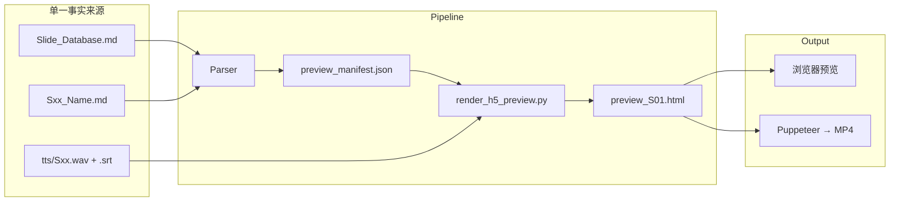

# 架构研究简报：H5 交互式预览系统

> **状态**: PROPOSAL (待评估)
> **提出日期**: 2026-01-30
> **优先级**: P2 (可选增强)

---

## 1. 问题陈述

### 1.1 当前状态
目前项目采用 **三阶段视觉管线**：
1. **Greybox**: `scaffold_visual_assets.py` 生成带布局的低保真占位 PNG
2. **生产**: 美术制作或 AI 生成最终 PNG
3. **预览**: `render_preview.py` 生成 MP4 视频 (TTS + 静态图)

### 1.2 局限性

| 痛点 | 影响 |
|:---|:---|
| **无原生音频预览**: 灰盒是静态图，无法感受讲课节奏 | 节奏验证需等到 MP4 生成后 |
| **PPT 文字脱离**: `Text`/`List` 在 DB 中定义，但灰盒只能显示预览，无法被 Keynote/PPT 识别 | 美术需手动复制文字 |
| **交互性为零**: 无法点击跳转、暂停、查看注释 | 教师备课体验差 |
| **更新延迟**: 修改脚本后需重新渲染 MP4 才能看到效果 | 迭代成本高 |

---

## 2. 提议方案：H5 交互式预览

### 2.1 核心理念
用 **HTML5 网页** 作为通用预览格式：
- 原生支持 `<audio>` 音频播放
- 支持 CSS 动画实现翻页效果
- 可热更新（改 JSON 即刷新）
- 可导出为视频（Puppeteer 截图流）

### 2.2 架构草图



### 2.3 预期收益

| 收益 | 说明 |
|:---|:---|
| **即时预览** | 保存脚本 → 刷新浏览器 → 立即看到效果 |
| **音频同步** | TTS 播放时自动翻页 (基于 SRT 时间码或 `(Visual: Sxx)` 标记) |
| **交互能力** | 点击暂停、跳转、查看备注、全屏 |
| **格式复用** | 同一 JSON 可输出 H5 预览、MP4 视频、甚至 Keynote |

---

## 3. 技术可行性分析

### 3.1 已有能力

| 能力 | 项目中已存在 |
|:---|:---|
| Slide 解析 | `scaffold_visual_assets.py` 已实现 DB 解析器 |
| SRT 解析 | `render_preview.py` 已实现 SRT → 时间码列表 |
| 视觉资产 | PNG 已按 `Sxx_Module/Sxx_ID.png` 结构存放 |
| FFmpeg | 已配置，用于现有 MP4 生成 |

### 3.2 需要新增

| 需求 | 技术选型线索 | 复杂度 |
|:---|:---|:---|
| **H5 模板引擎** | Jinja2 (Python) 或 Handlebars (Node) | 🟢 低 |
| **音频同步 JS** | Howler.js + 自定义时间轴控制 | 🟡 中 |
| **PPT 导出** | python-pptx 或 Keynote AppleScript | 🔴 高 |
| **视频录制** | Puppeteer + FFmpeg (或 Playwright) | 🟡 中 |

### 3.3 关键技术挑战

1. **SRT → 翻页映射**: 当前 SRT 只有字幕文本，不含 `(Visual: Sxx)` 标记。需要：
   - 在脚本中标准化 `(Visual: Sxx)` 标记
   - 或训练解析器从字幕语义推断翻页点

2. **字体渲染一致性**: H5 用网页字体，PPT/视频用系统字体。需确保视觉一致。

3. **离线可用**: 教师可能需要离线预览，需打包成单文件 HTML。

---

## 4. 线索与资源

### 4.1 类似项目参考

| 项目 | URL | 相关性 |
|:---|:---|:---|
| **Reveal.js** | https://revealjs.com/ | H5 幻灯片框架，支持 Markdown |
| **Slidev** | https://sli.dev/ | Vue 开发者向，支持代码高亮 |
| **Markdown Slides** | https://marp.app/ | Markdown → PPT/HTML |
| **AudioSlides** | (需搜索) | 音频同步幻灯片 |

### 4.2 技术文档

| 主题 | 资源 |
|:---|:---|
| 音频同步 | Web Audio API, Howler.js 文档 |
| PPT 生成 | `python-pptx` 库文档 |
| 视频录制 | Puppeteer `page.screenshot({ captureBeyondViewport: true })` |
| SRT 格式 | SubRip 规范 |

### 4.3 项目内关键文件

| 文件 | 用途 |
|:---|:---|
| [scaffold_visual_assets.py](file:///Users/yamlam/Downloads/数字音频编辑Audition实用教程-混响2/.agent/skills/validation-suite/scripts/scaffold_visual_assets.py) | 现有 DB 解析器，可复用 |
| [render_preview.py](file:///Users/yamlam/Downloads/数字音频编辑Audition实用教程-混响2/01_MVP_Demo/_Pipeline/composers/render_preview.py) | 现有 SRT 解析器和 FFmpeg 调用 |
| [Slide_Database.md](file:///Users/yamlam/Downloads/数字音频编辑Audition实用教程-混响2/02_Visuals/Slide_Database.md) | 视觉内容 SSOT |
| [rule_asset_management.md](file:///Users/yamlam/Downloads/数字音频编辑Audition实用教程-混响2/.agent/rules/rule_asset_management.md) | 资产命名规范 |

---

## 5. 评估建议

### 5.1 成本/收益对比

| 方案 | 开发成本 | 维护成本 | 用户价值 |
|:---|:---|:---|:---|
| **现有 MP4 管线** | ✅ 已完成 | 🟢 低 | 🟡 中 |
| **H5 预览 (基础)** | 🟡 ~2-3 天 | 🟡 中 | 🟢 高 |
| **H5 + PPT 导出** | 🔴 ~1 周 | 🔴 高 | ✅ 极高 |

### 5.2 推荐路径

```
Phase 1 (MVP): 纯 H5 预览
├── Jinja2 模板
├── 静态图片翻页
└── 手动控制 (无音频同步)

Phase 2: 音频同步
├── 集成 TTS wav
├── SRT 时间轴驱动翻页
└── Howler.js 播放器

Phase 3 (可选): 自动化导出
├── Puppeteer 录屏 → MP4
└── python-pptx → PPTX
```

---

## 6. 待回答的问题

下一位架构师在深入研究前，请先回答：

1. **用户场景**: 教师是否真的需要"边听 TTS 边看幻灯片"？还是只需要静态预览？
2. **交付物格式**: 最终产出是 MP4 视频还是 PPT 文件？这决定了 H5 是否只是中间产物。
3. **离线需求**: 教师是否需要本地离线预览，还是可以接受浏览器访问？
4. **技术栈偏好**: 团队是 Python 优先还是 Node 可接受？

---

**变更记录**:
- 2026-01-30: 初始版本 (基于深度架构审查会话)
