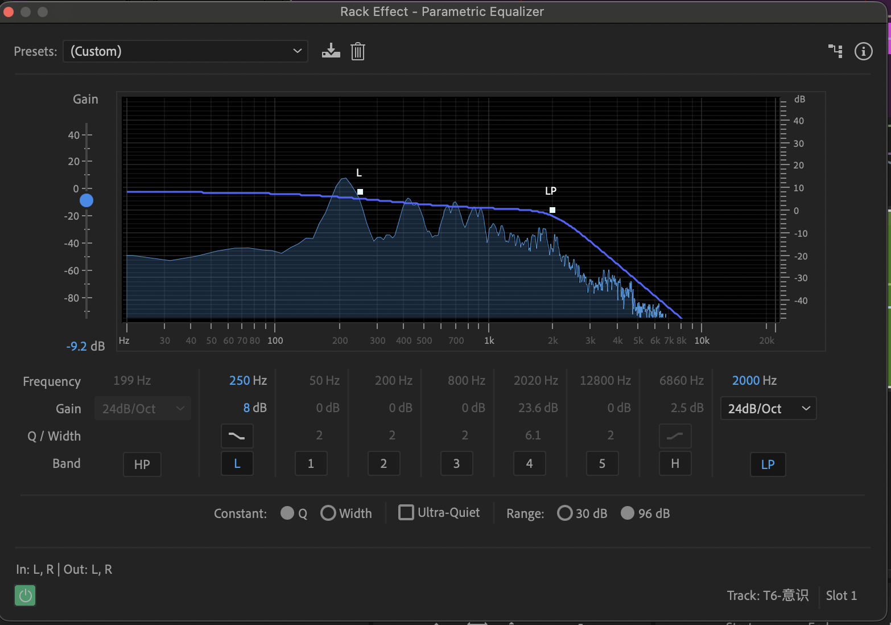
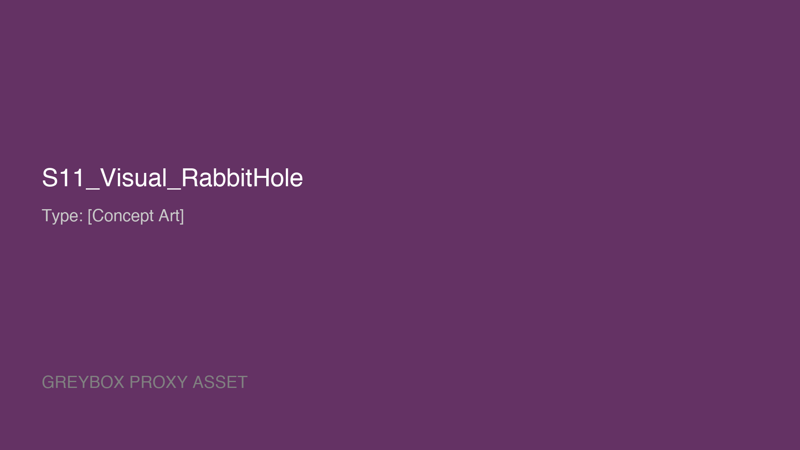
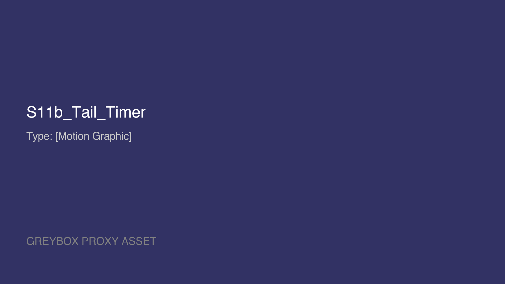

# Slide_Database (PPT 内容数据库)

> **Visual Style**: Cinematic, Minimalist Dark Mode, Waveform decorations.

---

## 📋 字段规范 (Field Specification)

每个 Slide 条目应包含以下字段:

| 字段 | 必填 | 说明 |
|:---|:---|:---|
| `Type` | ✅ | 类型标签: `[Concept Art]`, `[UI Graphic]`, `[Motion Graphic]`, `[Live Demo]`, `[Stock/Reference]`, `[Diagram]` |
| `Action` | 🎬 | **(Demo Only)** 具体操作步骤指令 (Storyboard) |
| `Target` | 🎬 | **(Demo Only)** 操作对象 (e.g. "Track 4 Automation Lane") |
| `Duration`| 🎬 | **(Demo Only)** 预计时长 (e.g. "~5s") |
| `Concept` | ✅ | 概念关键词 (中英文) |
| `Visual` | ✅ | 视觉描述 (中文,用于理解) |
| `Search` | 🔍 | 网络搜索关键词 (英文) |
| `AI_Prompt` | 🎨 | 文生图 Prompt (英文,含风格词) |
| `Caption` | 可选 | PPT 上显示的引用/注释 |
| `Text` | 可选 | PPT 上的主标题 |
| `List` | 可选 | PPT 上的列表内容 |
| `MediaStart`| 🎬 | (Video) 开始时间 (seconds) |
| `MediaEnd`  | 🎬 | (Video) 结束时间 (seconds) |

### 🎨 AI_Prompt 模板

```
[主体描述], [风格词], [画质词], [光照词], [构图词]

示例:
"A translucent ghost bird made of digital noise artifacts, floating in pure black void, 
glitch art style, 8K, cinematic lighting, centered composition"
```

### 🔍 Search 模板

```
[主体] [形容词] [场景/背景] site:unsplash.com OR site:pexels.com

示例:
"sound wave visualization abstract dark background site:unsplash.com"
```

---

## S01_Cover
*   **Type**: [Title Card]
*   **Concept**: 觉醒 (Awakening)
*   **Visual**: Dark mode abstract background. A faint, glowing ripple in the center of a deep black void, like a sound wave just beginning to propagate. No text.
*   **AI_Prompt**: `abstract cinematic background, a single faint glowing cyan sound wave ripple in the center of deep black void, minimal, breathing light, 8k, dark mode, no text`

## S01_Concept_Alice_RabbitHole
*   **Type**: [Concept Art]
*   **Concept**: 坠落兔洞 (The Rabbit Hole)
*   **Visual**: Surreal vertical perspective of Alice falling down an infinite dark rabbit hole.
*   **AI_Prompt**: `Surreal vertical perspective of Alice falling down an infinite dark rabbit hole, warped space time, floating furniture and clocks, dark fantasy, magical realism, cinematic lighting, depth of field, 8k, minimal, dark mode style`

## S01_Map_Four_Phases
*   **Type**: [Diagram/Map]
*   **Concept**: 四场战争 (The Four Wars)
*   **Visual**: A 2x2 grid composite of the four phase covers (S02, S03, S04, S05).
*   **Caption**: "The Battlefield Map."

## S02_Cover
*   **Type**: [Title Card]
*   **Concept**: 驱逐 (Expulsion)
*   **Visual**: Dark mode abstract background. A sharp, diagonal beam of light cutting through darkness, illuminating floating dust particles that are fading away. No text.
*   **AI_Prompt**: `abstract cinematic background, a sharp diagonal beam of light cutting through deep darkness, illuminating fading dust particles, tyndall effect, minimal, high contrast, 8k, dark mode, no text`

## S03_Cover
*   **Type**: [Title Card]
*   **Concept**: 塑形 (Sculpt)
*   **Visual**: Dark mode abstract background. Liquid metal or dark glass flowing in curves, bottom-heavy composition, smooth and viscous. No text.
*   **AI_Prompt**: `abstract cinematic background, flowing dark liquid metal or smooth dark glass, organic curves, viscous texture, bottom heavy composition, minimal, 8k, dark mode, no text`

## S04_Cover
*   **Type**: [Title Card]
*   **Concept**: 深渊 (Abyss)
*   **Visual**: Dark mode abstract background. A deep, symmetrical tunnel perspective fading into absolute black. 80ms of silence visualised. No text.
*   **AI_Prompt**: `abstract cinematic background, deep infinite tunnel perspective, symmetrical, fading into absolute pitch black, atmospheric depth, minimal, 8k, dark mode, no text`

## S05_Cover
*   **Type**: [Title Card]
*   **Concept**: 几何 (Geometry)
*   **Visual**: Dark mode abstract background. Extremely fine, low-opacity vector grid lines forming a 3D space. Precision and order. No text.
*   **AI_Prompt**: `abstract cinematic background, extremely fine low-opacity cyan vector grid lines forming 3d space, technical precision, blueprint aesthetic, minimal, 8k, dark mode, no text`

## S06_Cover
*   **Type**: [Title Card]
*   **Concept**: 闭环 (Loop)
*   **Visual**: Dark mode abstract background. A perfect, soft-focus ring of light (Bokeh) in the center. Completion. No text.
*   **AI_Prompt**: `abstract cinematic background, a perfect soft-focus ring of white light in center, bokeh effect, zen circle, completion, minimal, 8k, dark mode, no text`

## S05_Ext_Consciousness_EQ_cap
*   **Type**: [UI/Screenshot]
*   **Concept**: 意识EQ
*   **Visual**: EQ curve showing consciousness filter.
*   **Ref**: 

## S01_Title
*   **Type**: [UI Graphic]
*   **Text**: 声音的魔术师：Audition 混响与特效实战
*   **Sub**: 智慧课程《数字音频处理》第五章 (Part 2) | 主讲：林昕
*   **Visual**: Audition Logo + Static Soundwave (No Animation).

## S02_Voss_Clarke
*   **Type**: [Stock/Reference]
*   **Concept**: 1/f 噪音
*   **Visual**: Pink Noise spectrum vs Bach Concerto spectrum.
*   **Text**: "The 1/f Law: Nature's Heartbeat".
*   **Graphic**: Correlation graph from Voss & Clarke (1975).
*   **Search**: `Voss Clarke 1975 pink noise bach spectrum 1/f graph`

## S03_Concept_Source_Space_Ear (Core Model)
*   **Type**: [Diagram]
*   **Text**: 空间建模三要素
*   **Visual Diagram**:
    *   `[Sound Source/Actor]` ---> `[Box/Space]` ---> `[Ear/Listener]`
*   **Metaphor**: 声音是演员，混响是舞台，声像的观众席。


## S02_Boll_Spectral_Subtraction
*   **Type**: [Diagram/Science]
*   **Concept**: 谱减法原理
*   **Visual**: Diagram from Steven Boll's "Suppression of Acoustic Noise in Speech Using Spectral Subtraction" (1979).
*   **Text**: "Suppression of Acoustic Noise in Speech Using Spectral Subtraction"
*   **Ref**: 

## S02_Ghost_Math (Theoretical)
*   **Type**: [Diagram/Science]
*   **Concept**: 加博尔原子 (Gabor Atom)
*   **Visual**: A comparative grid diagram. Left side "STFT (Gabor)" shows a grid of uniform rectangles (Time-Frequency). Right side shows Wavelet analysis.
*   **Ref**: 
*   **Caption**: "Gabor's Atoms: The pixelation of sound."
*   **Metaphor**: 声音的像素，不能无限小。


## S02_UI_NoisePrint_cap
*   **Type**: [UI/Screenshot]
*   **Concept**: 噪声采样
*   **Visual**: Waveform view showing the selected noise print area.
*   **Ref**: 

## S02_UI_NR_Panel_Basic_cap
*   **Type**: [UI/Screenshot]
*   **Concept**: 降噪基础设置
*   **Visual**: Noise Reduction panel showing 75% Reduction and 50dB Reduce By.
*   **Ref**: 

## S02_UI_NR_Panel_Advanced_cap
*   **Type**: [UI/Screenshot]
*   **Concept**: 降噪高级设置
*   **Visual**: Noise Reduction panel showing Spectral Decay rate, Smoothing (4), Precision Factor (32), Transition Width (0dB).
*   **Ref**: 


## S02_Concept_Noise_Fingerprint
*   **Type**: [UI/Concept]
*   **Concept**: 噪音指纹 (The Fingerprint)
*   **Visual**: Close-up of Noise Reduction graph showing the yellow (Max) and red (Min) noise floor particles.
*   **Ref**: 

## S02_UI_Smoothing_Concept
*   **Type**: [UI/Concept]
*   **Concept**: 平滑度概念
*   **Visual**: UI screenshot showing the Smoothing parameter.
*   **Ref**: 

## S02_UI_Smoothing_Set_4
*   **Type**: [UI/Screenshot]
*   **Concept**: 设置平滑度为4
*   **Visual**: UI screenshot showing "Smoothing" set to 4.
*   **Ref**: 

## S02_UI_Curve_Shape_cap
*   **Type**: [UI/Screenshot]
*   **Concept**: 降噪曲线形态
*   **Visual**: Noise Reduction Curve showing the "Low Frequency Protection" slope (0Hz/-43dB, 3.3k/-9dB, 24k/0dB).
*   **Ref**: 

## S02_Visual_Apply_cap
*   **Type**: [UI/Screenshot]
*   **Concept**: 验证与应用
*   **Visual**: Verification step before applying noise reduction.
*   **Ref**: 

## S02_UI_SelectAll_EnterNR_cap
*   **Type**: [UI/Screenshot]
*   **Concept**: 全选进入降噪
*   **Visual**: Waveform selected (Ctrl+A) and menu path to Noise Reduction.
*   **Ref**: 

## S02_UI_Dust_cap
*   **Type**: [UI/Screenshot]
*   **Concept**: 现实的尘埃
*   **Visual**: Zoomed in waveform showing the dirty noise floor.
*   **Ref**: 


## S02_Preview_NoiseOnly
*   **Type**: [Video]
*   **Concept**: 原始带噪心跳预览
*   **Visual**: Screen recording of playing the dirty heartbeat audio.
*   **MediaStart**: 0
*   **Ref**: 

## S02_Demo_OutputNoiseOnly
*   **Type**: [Video]
*   **Concept**: 仅输出噪音功能演示
*   **Visual**: Screen recording of "Output Noise Only" check.
*   **MediaStart**: 0
*   **Ref**: 

## S02_Demo_OutputNoiseOnlyUncheck_cap
*   **Type**: [UI/Screenshot]
*   **Concept**: 取消勾选仅输出噪音
*   **Visual**: 降噪面板特写，取消勾选 "Output Noise Only" (仅输出噪音)。
*   **Ref**: 

## S02_Preview_Final
*   **Type**: [Video]
*   **Concept**: 最终效果预览
*   **Visual**: Screen recording of final noise reduction result.
*   **MediaStart**: 0
*   **Ref**: 


## S02_Anechoic_Chamber
*   **Type**: [Photo/Science]
*   **Concept**: 不存在的无 (John Cage)
*   **Visual**: John Cage or a person sitting in a modern Anechoic Chamber (with foam wedges).
*   **Caption**: "The impossible silence: Hearing your own nervous system."
*   **Search**: `Anechoic chamber interior foam wedges John Cage photo`
*   **Ref**: 

## S03_Visual_Alice_Drink (Metaphor)
*   **Type**: [Concept Art]
*   **Concept**: 塑形与变形 (Sculpt)
*   **Visual**: 爱丽丝喝下药水后身体开始变形的瞬间,音频波形与身体轮廓融合
*   **Search**: `Alice in Wonderland drinking potion transformation, surreal, dark fantasy`
*   **AI_Prompt**: `Alice in Wonderland drinking a glowing potion, her body transforming and stretching, audio waveforms merging with her silhouette, dark fantasy surreal style, Tim Burton aesthetic, deep purple and blue tones, 8K, cinematic dramatic lighting, centered composition`
*   **Ref Image**: *Alice in Wonderland* (1951 or 2010), Alice drinking the potion / Giant Alice.
*   **Caption**: "通过变调 (Pitch)，我们改变的不是声音，是角色的物理形态。"

## S03_Preview_Ugly_Duckling
*   **Type**: [Video]
*   **Concept**: 原声试听
*   **Visual**: Screen recording of `demo_S03_ugly_duckling.wav` playing in Audition.
*   **MediaStart**: 0
*   **MediaEnd**: 3.7
*   **Ref**: 

## S03_Tape_Machine
*   **Type**: [Animation]
*   **Concept**: 克洛诺斯的诅咒 (Time/Pitch)
*   **Visual**: Old Reel-to-Reel Tape machine spinning erratically.
*   **Text**: Speed ↑ = Pitch ↑ = Time ↓

## S03_Pierre_Schaeffer
*   **Type**: [Photo/Historical]
*   **Concept**: 声音对象 (Sound Object)
*   **Visual**: Photo of Pierre Schaeffer (1948) operating turntables.
*   **Text**: "Acousmatic: The sound one hears without seeing the causes behind it."

## S03_Chipmunk
*   **Type**: [Photo/Historical]
*   **Concept**: 廉价的笑话 (The Cheap Joke)
*   **Visual**: Photo of Ross Bagdasarian (1958) with Alvin and the Chipmunks.
*   **Caption**: "High Pitch = Low Dignity."

## S03_Spring_Restoration
*   **Type**: [Diagram]
*   **Concept**: 物理还原 (The Spring)
*   **Visual**: A compressed metal spring (labeled "High Pitch") being pulled by invisible hands to its full, relaxed length (labeled "Restored").
*   **AI_Prompt**: `minimalist geometric diagram, a compressed metal spring on left labeled High Pitch, the same spring stretched to relaxation on right labeled Restored, invisible hands pulling it, physics schematic, bauhaus style, white lines on black background, 8k`
*   **Caption**: "Unchecking 'Preserve' = Restoring the Spring."
*   **Metaphor**: 并不是把她变大，而是让被压缩的她，弹回原状。

## S03_Visual_Cake
*   **Type**: [Concept Art]
*   **Concept**: 吃下蛋糕 (The Antidote)
*   **Visual**: A macro shot of a beautiful, glowing cake with the words "EAT ME" written in icing. The cake texture looks dense and heavy (physical weight). Dark fantasy style.
*   **AI_Prompt**: `macro shot of a glowing magical cake with EAT ME icing, dark fantasy style, alice in wonderland, dense heavy texture, cinematic lighting, 8k`
*   **Caption**: "A recipe for restoring gravity."

## S03_Viscosity
*   **Type**: [Concept Art]
*   **Concept**: 时间的粘稠度
*   **Visual**: Honey or golden syrup dripping slowly in a void. A clock melting into liquid gold.
*   **AI_Prompt**: `surreal melting clock dripping like golden honey, viscosity of time, dali style, dark void background, high contrast, 8k`
*   **Caption**: "145%: Breathing in the syrup."

## S03_UI_Trap_Pitch
*   **Type**: [UI/Screenshot]
*   **Concept**: 陷阱 (Wrong Pitch)
*   **Visual**: Audition `Time and Pitch` panel. Pitch Shift set to +3 semitones.
*   **Caption**: "The Chipmunk Trap."
*   **Ref**: 

## S03_UI_Unlock_Stretch
*   **Type**: [UI/Screenshot]
*   **Concept**: 解锁比例
*   **Visual**: `Time and Pitch` panel. Mouse hovering over/unchecking the "Lock" icon.
*   **Caption**: "Unlocking Time from Space."
*   **Ref**: 

## S03_UI_Time_Stretch
*   **Type**: [UI/Screenshot]
*   **Concept**: 粘稠度设定
*   **Visual**: `Time and Pitch` panel. Stretch % input set to 145%.
*   **Caption**: "145% Viscosity."
*   **Ref**: 

## S03_UI_Pitch_Restoration
*   **Type**: [UI/Screenshot]
*   **Concept**: 物理还原
*   **Visual**: `Time and Pitch` panel. Pitch Shift set to -5.29 semitones.
*   **Caption**: "Gravity: -5.29 Semitones."
*   **Ref**: 

## S03_UI_Uncheck_Preserve
*   **Type**: [UI/Screenshot]
*   **Concept**: 放弃伪装
*   **Visual**: `Time and Pitch` panel. "Preserve Speech Characteristics" UNCHECKED.
*   **Caption**: "Letting the Formants Drop."
*   **Ref**: 


## S03_Preview_Final_Sculpt
*   **Type**: [Video]
*   **Concept**: 最终试听
*   **Visual**: Screen recording of `asset_S03_alice_sculpted.wav` playing. The waveform is longer and denser.
*   **MediaStart**: 0
*   **MediaEnd**: 5.4
*   **Ref**: 

## S04_Visual_RabbitHole (Metaphor)
*   **Type**: [Concept Art]
*   **Concept**: 空间置景 (Space)
*   **Ref Image**: Alice falling down the deep rabbit hole.
*   **AI_Prompt**: `Surreal vertical perspective of Alice falling down an infinite dark rabbit hole, warped space time, floating furniture and clocks, dark fantasy, magical realism, cinematic lighting, depth of field, 8k`
*   **Caption**: "混响定义了‘无底深渊’的深度。"
*   **Ref**: 

## S04_Tail_Timer
*   **Type**: [Motion Graphic]
*   **Concept**: 捕捉尾音 (Catching the Tail)
*   **Visual**: A high-contrast "Stopwatch" or Digital Counter.
*   **Action**: Counts up from 0s to 5s... then fades out as the sound disappear.
*   **Goal**: Visualize the decay time for the audience.
*   **Ref**: 

## S04_Balloon_Cave
*   **Type**: [Diagram]
*   **Concept**: 脉冲响应 (IR)
*   **Visual**: Hand-drawn diagram of a balloon exploding in a cave, showing reflection paths.
*   **Text**: "Impulse Response: The DNA of Space".

## S04_Air_Absorption_Chart
*   **Type**: [Chart]
*   **Concept**: 空气吸收 (Physics)
*   **Visual**: Chart showing air absorption coefficient vs frequency.
*   **Caption**: "Air Absorption: High frequencies die first."
*   **Ref**: 

## S04_Automation_Dissolution
*   **Type**: [UI/Screenshot]
*   **Concept**: 灵魂出窍
*   **Visual**: Multitrack Envelope Automation.
*   **Curve**: Blue line rising from 0% to 75%.
*   **Text**: "Dissolution".

## S05_Visual_Inception (Metaphor)
*   **Type**: [Concept Art]
*   **Concept**: 空间折叠/定位 (Position)
*   **Visual**: A surreal cityscape folding upwards on both sides (Inception style), representing the "Stereo Expand" effect wrapping reality around the listener.
*   **Dimensions**: 1920x1080 (16:9)
*   **AI_Prompt**: `Cinematic shot of a city folding onto itself, inception movie style bending reality, architectural surrealism, dark moody atmosphere, deep teal and orange color grading, wide angle lens, 8k resolution, highly detailed, dramatic lighting, volumetric fog, symmetry`
*   **Caption**: "立体声扩展 (Stereo Expand) 让现实扭曲，创造包裹感。"
*   **Overlay**: Animated headphone icon + Radial Spectrum extending left/right.

## S06_Summary_Loop
*   **Type**: [Diagram]
*   **Concept**: 剧场谢幕
*   **Diagram**: Circle Flow
    1.  Purify (此在)
    2.  Sculpt (彼在)
    3.  Space (何处)
    4.  Position (何方)
*   **Text**: 每一个参数，都是一种立场。


## S06_Murch_Rule_of_Six
*   **Type**: [Diagram]
*   **Concept**: 剪辑六法则 (Philosophy)
*   **Visual**: A Pyramid Diagram.
    1.  **Emotion (51%)** - Top
    2.  **Story (23%)**
    3.  **Rhythm (10%)**
    4.  **Eye Trace (7%)**
    5.  **2D Plane (5%)**
    6.  **3D Space (4%)**
*   **Highlight**: "Emotion" is the biggest block.
*   **Ref**: 

## S06_Homework
*   **Type**: [Task Card]
*   **Title**: 课后挑战：逃离麦克风 (Escape the Mic)
*   **Task**: 录制一段干声，利用四步法（净化-塑形-置景-定位）将其“异化”。
*   **Requirement**: 提交 MP3 + 200字创作说明（解释你的导演决策）。

---


*   **Type**: [Diagram/Historical]
*   **Concept**: 1/f 噪音
*   **Visual**: Pink Noise spectrum vs Bach Concerto spectrum.
*   **Text**: "The 1/f Law: Nature's Heartbeat".
*   **Graphic**: Correlation graph from Voss & Clarke (1975).

## S04_Inchindown_Tanks
*   **Type**: [Concept Art/Homage]
*   **Concept**: 工业深渊 (The Abyss)
*   **Visual**: Cinematic fusion of Inchindown Oil Tank and Cameron's "The Abyss" (1989). Dark, rusty, infinite industrial tunnel with eerie bioluminescent underwater lighting.
*   **Text**: "The Abyss 1989"
*   **AI_Prompt**: `cinematic shot inside the endless Inchindown oil tank, rusty metal walls, deep dark water reflection, james cameron's the abyss 1989 style, eerie blue underwater bioluminescent lighting, atmospheric fog, 8k, text "The Abyss 1989" clearly visible in retro sci-fi font glowing on the wall`
*   **Ref**: 

## S04_Alvin_Lucier
*   **Type**: [Photo/Historical]
*   **Concept**: 空间作为乐器
*   **Visual**: Photo of Alvin Lucier sitting in a room with a microphone.
*   **Text**: "I am sitting in a room..."
*   **Search**: `Alvin Lucier I am sitting in a room performance photo`

## S04_Neubauten
*   **Type**: [Photo/Band]
*   **Concept**: 工业深渊
*   **Visual**: Einstürzende Neubauten banging on metal pipes in a highway underpass.
*   **Caption**: "Finding tone in the industrial noise."
*   **Search**: `Einstürzende Neubauten industrial percussion performance photo`


## S04_IR_Recording
*   **Type**: [Photo/Historical]
*   **Concept**: 声学摄影 (Audio Ease)
*   **Visual**: A photo of an acoustician (or Audio Ease team) recording an IR in a large hall or church, holding a pistol or slate.
*   **Caption**: "Capturing the acoustic fingerprint."
*   **Search**: `Audio Ease Altiverb recording IR impulse response pistol church hall photo`

## S04_Visual_Sound_Hunter
*   **Type**: [Concept Art]
*   **Concept**: 声音猎人 (The Visual Metaphor)
*   **Visual**: A surreal 'Sound Hunter' firing a pistol in a dark void. The 'muzzle flash' is a glowing blue wireframe shockwave that instantly maps the invisible architecture.
*   **AI_Prompt**: `cinematic concept art, a silhouette of a sound engineer standing in a vast dark void, firing a starter pistol upwards, the muzzle flash is a glowing cyan digital wireframe shockwave expanding outwards and revealing the invisible 3d geometry of a cathedral, visualizing impulse response, sci-fi surrealism, tyndall effect, 8k, dramatic lighting`
*   **Ref**: 

## S04_Impulse_Specs
*   **Type**: [Infographic]
*   **Concept**: 脉冲文件规范 (The Recipe)
*   **Visual**: A minimalist Bauhaus-style technical specification card. Geometric icons representing "WAV/AIFF" (Uncompressed), "32-bit" (Depth), and a "Stopwatch" stopped at 30s (Duration).
*   **AI_Prompt**: `bauhaus style infographic, minimalist technical icons for audio file wav 32-bit and stopwatch set to 30 seconds, geometric composition, orange and dark grey color palette, clean vector aesthetics, 8k, text "30s LIMIT" and "32-BIT"`
*   **Ref**: 

## S04_BladeRunner_City
*   **Type**: [Key Visual]
*   **Concept**: 人造孤独 (Blade Runner)
*   **Visual**: Iconic shot from Blade Runner (1982) showing the rainy, neon-lit futuristic city (Cyberpunk Aesthetic).
*   **Caption**: "Synthetic Loneliness: Making it rain psychologically."
*   **Search**: `Blade Runner 1982 city rain neon cinematography wide shot`


## S04_Anechoic_Chamber
*   **Type**: [Photo/Science]
*   **Concept**: 不存在的无 (John Cage)
*   **Title**: 约翰·凯奇的消声室
*   **Visual**: John Cage or a person sitting in a modern Anechoic Chamber (with foam wedges).
*   **Caption**: "The impossible silence: Hearing your own nervous system."
*   **Search**: `Anechoic chamber interior foam wedges John Cage photo`

## S04_UI_HardLimiter
*   **Type**: [UI/Screenshot]
*   **Concept**: 安全网
*   **Visual**: Hard Limiter Panel.
*   **Settings**: Max Amplitude = -0.1dB.
*   **Overlay**: Green text "SAFE".
*   **Ref**: 

## S04_Conclusion_Abyss
*   **Type**: [Concept Art]
*   **Concept**: 听见深渊
*   **Visual**: Alice floating in a vast, dark, cylindrical tank (The Oil Tank).
*   **AI_Prompt**: `A tiny Alice floating in the center of a massive dark industrial oil tank interior, rusty metal curved walls, deep water reflection, eerie, solitary, wide angle, cinematic lighting, volumetric fog, blue and black tones, 8k`
*   **Caption**: "All knobs serve the 80ms of terror."


## S04_UI_RoomSize
*   **Type**: [UI/Screenshot]
*   **Concept**: 房间尺寸
*   **Visual**: Convolution Reverb Room Size parameter set to 100%.
*   **Ref**: 

## S04_UI_PreDelay_80ms
*   **Type**: [UI/Screenshot]
*   **Concept**: 惊恐的空白
*   **Visual**: Close-up of Pre-Delay knob set specifically to 80ms.
*   **Caption**: "80ms: The calculated terror."
*   **Ref**: 

## S04_Deep_Listening
*   **Type**: [Text/Minimalist]
*   **Concept**: 深渊的底色
*   **Visual**: Pure Black Screen.
*   **Text**: Deep Listening.
*   **Ref**: 

## S04_UI_Width_150
*   **Type**: [UI/Screenshot]
*   **Concept**: 空间爆破
*   **Visual**: Width parameter pulled to 150% (or Stereo Expander).
*   **Caption**: "Exploding the point into a sphere."
*   **Ref**: 

## S04_UI_IR_Types
*   **Type**: [UI/Screenshot]
*   **Concept**: 空间类型对比
*   **Visual**: Split screen or Composite showing 3 IR types selected: "Small Closet", "Large Hall", "The Void".
*   **Caption**: "Closet vs Hall vs Void."
*   **Ref**: 

## S04_UI_Conv_EQ
*   **Type**: [UI/Screenshot]
*   **Concept**: 卷积EQ设置
*   **Visual**: The EQ tab in Convolution Reverb plugin.
*   **Settings**: Low Cut active (200Hz), Damping HF active.
*   **Caption**: "Cleaning the mud, dimming the light."
*   **Ref**: 

## S04_UI_Conv_Damping
*   **Type**: [UI/Screenshot]
*   **Concept**: 阻尼设置
*   **Visual**: Convolution Reverb panel focusing on Damping LF and Damping HF sliders.
*   **Settings**: Damping LF attenuated, Damping HF attenuated.
*   **Caption**: "Physics of the Abyss: Damping."
*   **Ref**: 

## S04_UI_OutputGain_Headroom
*   **Type**: [UI/Screenshot]
*   **Concept**: 动态余量
*   **Visual**: Output Gain or Track Volume set to -6dB.
*   **Caption**: "Headroom: Space for the abyss to breathe."
*   **Ref**: 

## S04_Cover_Seg0_Shape
*   **Type**: [Title Card]
*   **Concept**: 空间的迷思
*   **Visual**: Kandinsky style abstract composition. A flat grey square representing dry sound versus a deep spiraling infinite tunnel loop representing wet sound, high contrast, bauhaus aesthetic.
*   **AI_Prompt**: `Kandinsky style abstract composition, a flat grey square representing dry sound versus a deep spiraling infinite tunnel loop representing wet sound, high contrast, bauhaus aesthetic, black background, 8k`
*   **Text**: "Segment 0: The Myth"

## S04_Cover_Seg1_Use
*   **Type**: [Title Card]
*   **Concept**: 幽灵的DNA
*   **Visual**: Kandinsky style abstract composition. A balloon explosion turning into sound waves.
*   **AI_Prompt**: `Kandinsky style abstract composition, a geometric balloon explosion scattering into rhythmic sound waves, impulse response visualization, constructivism, black background, 8k`
*   **Text**: "Segment 1: The DNA"

## S04_Cover_Seg2_Void
*   **Type**: [Title Card]
*   **Concept**: 寻找虚无
*   **Visual**: Kandinsky style abstract composition. A large empty circle in the void.
*   **AI_Prompt**: `Kandinsky style abstract composition, a perfect large void circle in the center of chaotic noise, minimalism, zen, bauhaus, black background, 8k`
*   **Text**: "Segment 2: The Void"

## S04_Cover_Seg3_Physics
*   **Type**: [Title Card]
*   **Concept**: 深渊物理学
*   **Visual**: Kandinsky style abstract composition. Long stretched lines representing time and damping.
*   **AI_Prompt**: `Kandinsky style abstract composition, long vertical lines stretching into infinity, frequency damping curves, physics of sound, constructivism, black background, 8k`
*   **Text**: "Segment 3: The Physics"

## S04_Cover_Seg4_Body
*   **Type**: [Title Card]
*   **Concept**: 灵魂出窍
*   **Visual**: Kandinsky style abstract composition. Two shapes separating, one solid, one ghost-like.
*   **AI_Prompt**: `Kandinsky style abstract composition, a solid geometric shape separating from its translucent shadow, dissociation, echo effect, bauhaus, black background, 8k`
*   **Text**: "Segment 4: The Out-of-Body"

## S04_Cover_Seg5_End
*   **Type**: [Title Card]
*   **Concept**: 听见深渊
*   **Visual**: Kandinsky style abstract composition. Deep blue complex geometry.
*   **AI_Prompt**: `Kandinsky style abstract composition, deep dark blue geometric structures, complex acoustics, depth, mystery, bauhaus, black background, 8k`
*   **Text**: "Segment 5: Hearing the Abyss"

## S04_Myth_Echo_Narcissus
*   **Type**: [Concept Art]
*   **Concept**: 回声神话 (Echo)
*   **Visual**: A classical oil painting style of the nymph Echo fading into transparency in a forest, watching Narcissus.
*   **AI_Prompt**: `classical oil painting, waterhouse style, the nymph Echo fading into transparency and mist in a dark ancient forest, watching Narcissus from the shadows, sad and ethereal, romanticism, emotional, high detail, 8k`
*   **Caption**: "She lost her body, and became only a voice."

## S04_UI_Perf_Buffer
*   **Type**: [UI/Screenshot]
*   **Concept**: 性能预优化
*   **Visual**: Preferences > Audio Hardware > I/O Buffer Size set to 512 samples.
*   **Ref**: 

## S04_Haas_Effect_Diagram
*   **Type**: [Diagram/Screenshot]
*   **Concept**: 哈斯效应
*   **Visual**: Diagram showing the 40ms boundary for echo fusion vs dissociation.
*   **Ref**: 

## S04_Envelope_Show_Mix
*   **Type**: [UI/Screenshot]
*   **Concept**: 显示包络
*   **Visual**: Dropdown menu showing how to enable "Mix" envelope.
*   **Ref**: 

## S04_Envelope_Mix_Keyframes
*   **Type**: [UI/Screenshot]
*   **Concept**: 绘制关键帧
*   **Visual**: Curve showing start (0%) and end (75%) keyframes.
*   **Ref**: 

## S04_UI_Three_IRs
*   **Type**: [UI/Screenshot]
*   **Concept**: IR素材导入
*   **Visual**: Project Panel showing alice_dry, closet, hall, and void files.
*   **Ref**: 
## S04_Concept_Dry_Wet
*   **Type**: [Concept Art]
*   **Concept**: 干湿对比
*   **Visual**: Split comparison. Dry is a hard, sharp stone. Wet is the same stone dissolving into ink in water.
*   **AI_Prompt**: `split screen comparison, left side is a sharp geometric stone object in void, right side is the same stone dissolving into black ink in water, physics of sound, dry vs wet signal, artistic metaphor, high contrast, 8k`
*   **Caption**: "Dry is the Object. Wet is the Shadow."

## S04_Damping_Curve
*   **Type**: [Diagram]
*   **Concept**: 阻尼曲线
*   **Visual**: A graph showing high frequencies decaying faster than low frequencies over time.
*   **Caption**: "High frequencies die first."

## S04_Phase_Warning
*   **Type**: [Warning Card]
*   **Concept**: 相位抵消
*   **Visual**: A red warning sign with a "Mono" icon crossed out, or two waves cancelling each other out (flat line).
*   **Caption**: "Warning: Phase Cancellation in Mono."


## S05_Blumlein_Walking

*   **Type**: [Photo/Historical]
*   **Concept**: 立体声行走
*   **Visual**: Alan Blumlein walking in front of a microphone pair at Abbey Road (1933).
*   **Text**: "Testing Presence, not just Wire."
*   **Caption**: "On this day in 1931, EMI engineer Alan Dower Blumlein filed a patent for a two-channel audio system, or what we now know as ‘Stereo’."
*   **Ref**: 

## S05_Diff_Material_Preview
*   **Type**: [Video]
*   **Concept**: 深听测试 (Deep Listening)
*   **MediaStart**: 6.82
*   **MediaEnd**: 21.715
*   **Visual**: Screen recording of the audio process.
*   **Ref**: 

## S05_Audition_Check
*   **Type**: [UI/Icon]
*   **Concept**: 听觉检查
*   **Visual**: Minimalist icon of an ear or headphones, pulsating slightly.
*   **Text**: "Audition Check"
*   **Caption**: "Don't look. Listen."
*   **Ref**: 
*   **AI_Prompt**: `minimalist icon design, listening ear symbol, glowing cyan lines on black background, hud interface style, 8k`

## S05_Preview_Heart_Raw
*   **Type**: [Video]
*   **Concept**: 心跳原声预览
*   **Visual**: Screen recording of playing the raw Heartbeat audio.
*   **Ref**: 

## S05_Preview_Wall_Raw
*   **Type**: [Video]
*   **Concept**: 压力原声预览
*   **Visual**: Screen recording of playing the raw Pressure audio.
*   **Ref**: 

## S05_Preview_Needle_Raw
*   **Type**: [Video]
*   **Concept**: 焦虑原声预览
*   **Visual**: Screen recording of playing the raw Anxiety audio.
*   **Ref**: 

## S05_Preview_Wall_Final
*   **Type**: [Video]
*   **Concept**: 墙体最终效果预览
*   **Visual**: Screen recording of the processed Wall audio impact.
*   **Ref**: 

## S05_Preview_Needle_Final
*   **Type**: [Video]
*   **Concept**: 针刺最终效果预览
*   **Visual**: Screen recording of the processed Needle audio flyover.
*   **Ref**: 


## S05_Fantasound_Layout
*   **Type**: [Diagram]
*   **Concept**: 原始的自动化
*   **Visual**: The 1940 Fantasound Speaker Layout + The "Tadpole" optical track.
*   **Caption**: "The Ancestor of Automation."
*   **Ref**: 

## S05_Setup_Surround_NewSession
*   **Type**: [UI/Screenshot]
*   **Concept**: 5.1 环境设置
*   **Visual**: New Multitrack Session Dialog with "5.1 Surround" highlighted.
*   **Ref**: 

## S05_Add_Bus_RightClick
*   **Type**: [UI/Screenshot]
*   **Concept**: 右键添加总线
*   **Visual**: 在轨道空白处右键弹出菜单，显示 Track > Add Stereo Bus Track 的操作路径。
*   **Ref**: 

## S05_Setup_Bus_Creation
*   **Type**: [UI/Screenshot]
*   **Concept**: 创建总线
*   **Visual**: Multitrack View showing "Add Stereo Bus Track" menu action.
*   **Ref**: 

## S05_Setup_Bus_Reverb
*   **Type**: [UI/Screenshot]
*   **Concept**: 加载混响
*   **Visual**: Effect Rack on "The Void" bus showing Convolution Reverb loaded.
*   **Ref**: 

## S05_Setup_IR_Detail
*   **Type**: [UI/Screenshot]
*   **Concept**: 加载脉冲响应
*   **Visual**: Action of dragging/loading `asset_S04_void_ir.wav` into the plugin.
*   **Ref**: 

## S05_Setup_Import_Tracks
*   **Type**: [UI/Screenshot]
*   **Concept**: 导入素材与布局
*   **Visual**: Project showing the 3 actors (Heart, Wall, Needle) imported onto tracks.
*   **Ref**: 


## S05_Setup_Sends_Routing
*   **Type**: [UI/Screenshot]
*   **Concept**: 发送路由
*   **Visual**: Mixer View showing Sends to "The Void" at -3dB.
*   **Ref**: 

## S05_Setup_Surround_NewSession
*   **Type**: [UI/Screenshot]
*   **Concept**: 建立笼子
*   **Visual**: New Multitrack Session dialog selecting "5.1".
*   **Ref**: 

## S05_Wall_EQ_Start
*   **Type**: [UI/Screenshot]
*   **Concept**: 墙在远方
*   **Visual**: Parametric EQ at 2000Hz / -40dB (Muffled, distant).
*   **Ref**: 

## S05_Wall_EQ_HighFreq_Return_demo
*   **Type**: [Video]
*   **Concept**: 高频回归演示
*   **Visual**: Screen recording showing the effect of bringing back high frequencies.
*   **Ref**: 

## S05_Automation_Curve
*   **Type**: [UI/Screenshot]
*   **Concept**: 蝌蚪的后裔
*   **Visual**: Close-up of an automation envelope line with keyframes, looking like a "tadpole" or biological curve.
*   **Ref**: 

## S05_Wall_EQ_End
*   **Type**: [UI/Screenshot]
*   **Concept**: 墙在眼前 (刺破)
*   **Visual**: Parametric EQ at 20,000Hz / +12dB (Impact, piercing).
*   **Ref**: 


## S05_Needle_Automation_Setup_cap
*   **Type**: [UI/Screenshot]
*   **Concept**: 焦虑之刺 (Setup)
*   **Visual**: Setup showing Pan Angle and Radius envelopes enabled for Track 3.
*   **Ref**: 

## S05_Needle_Pan_Angle_cap
*   **Type**: [UI/Screenshot]
*   **Concept**: 360度环绕
*   **Visual**: Pan Angle envelope moving from -180 to +180 degrees.
*   **Ref**: 

## S05_Needle_Pan_Radius_cap
*   **Type**: [UI/Screenshot]
*   **Concept**: 螺旋逼近
*   **Visual**: Pan Radius envelope dropping from 96% to 20%.
*   **Ref**: 

## S05_Needle_Pan_Random_cap
*   **Type**: [UI/Screenshot]
*   **Concept**: 随机不规则环绕
*   **Visual**: Spline curves showing chaotic/random pan movement.
*   **Ref**: 


## S05_EQ_Automation_Setup_cap
*   **Type**: [UI/Screenshot]
*   **Concept**: 自动化曲线设置
*   **Visual**: Show Envelopes menu with "Band 5 Freq" and "Band 5 Gain" selected.
*   **Ref**: 

## S05_EQ_Automation_Freq_cap
*   **Type**: [UI/Screenshot]
*   **Concept**: 频率自动化 (Step 1)
*   **Visual**: Automation lane for Parametric EQ Band 5 Freq, showing curve from 2000Hz to 20000Hz.
*   **Ref**: 

## S05_EQ_Automation_Gain_cap
*   **Type**: [UI/Screenshot]
*   **Concept**: 增益自动化 (Step 2)
*   **Visual**: Automation lane for Parametric EQ Band 5 Gain, showing curve from -40dB to +12dB.
*   **Ref**: 

## S05_EQ_Automation_Curve_cap
*   **Type**: [UI/Screenshot]
*   **Concept**: 绘制滤波器曲线 (Combined)
*   **Visual**: Two automation lines: Freq rising from 2k to 20k, Gain rising from -40 to +12dB.
*   **Ref**: 

## S05_EQ_Final_View_cap
*   **Type**: [UI/Screenshot]
*   **Concept**: 最终EQ视图
*   **Visual**: The resulting automation curves on the track.
*   **Ref**: 

## S05_Pan_Radius_Toggle_cap
*   **Type**: [UI/Screenshot]
*   **Concept**: 启用半径参数
*   **Visual**: Show Envelopes menu with "Radius" selected for Track Panner.
*   **Ref**: 

## S05_Pan_Radius_Curve_cap
*   **Type**: [UI/Screenshot]
*   **Concept**: 墙体逼近
*   **Visual**: Radius automation curve dropping from high to low (Wall closing in).
*   **Ref**: 


## S05_Azimuth_Coordinator
*   **Type**: [Photo/Historical]
*   **Concept**: 方位协调器
*   **Visual**: Photo of the joystick device used by Pink Floyd.
*   **Caption**: "Surround Sound in 1972."

## S05_Janet_Cardiff
*   **Type**: [Photo/Art]
*   **Concept**: 声音雕塑
*   **Visual**: The 40 Speakers arranged in an oval for "The Forty Part Motet".
*   **Text**: "Sound as Sculpture."

## S05_Geometry_Loneliness
*   **Type**: [Concept Art]
*   **Concept**: 孤独的几何学 (Geometric Collapse)
*   **Visual**: 几何崩塌。巨大的灰色平面（墙）与白色螺旋（针）在深蓝色虚空中粉碎，碎片向四周迸射，唯有一个微小的红点（心脏）静止在圆心。
*   **AI_Prompt**: `Kandinsky style abstract composition of geometric collapse, massive grey rectangular planes and sharp white spiral lines shattering into fragments in a deep blue glowing void, a single tiny static red dot at the absolute center, debris flying outwards, constructivism, bauhaus aesthetic, dynamic explosion but with sense of absolute isolation at center, high contrast, black background, 8k, vector surrealism`
*   **Text**: "The Geometry of Loneliness"
*   **Ref**: 


## S05_Act_Draw_Filter
*   **Type**: [Live Demo]
*   **Target**: Track 2 Automation Lane (Parametric EQ)
*   **Action**: 绘制 Low Pass Filter 曲线 (Approaching Wedge)。频率从 2000Hz (闷) 平滑上升至 20,000Hz (刺破)。
*   **Duration**: ~10s
*   **Caption**: "The Wall is opening."

## S05_Act_Perform_Pan
*   **Type**: [Diagram]
*   **Concept**: 螺旋轨迹 (The Spiral Formula)
*   **Visual**: 一个极简的几何示意图。在黑色背景上，一条白色的螺旋线从外圈线性地向内圈收缩，展示了 Radius (100 -> 50) 和 Angle (-180 -> 180) 的线性关系。
*   **Target**: Track 3 Pan Automation Lane (Angle & Radius)
*   **Action**: (Draw Keyframes) 手动绘制 Spline 曲线，让 Angle 在 -180 到 +180 之间线性变化，Radius 线性减小。
*   **AI_Prompt**: `Minimalist geometric diagram, a single clean sharp white spiral line on a pitch black background. The spiral starts from the outer edge and smoothy winds inwards to the center, representing a linear decrease in radius while rotating 360 degrees. Bauhaus style, high contrast, pure geometry, vector aesthetic, no text, 8k.`
*   **Duration**: ~15s
*   **Caption**: "Linear Scale: Angle vs Radius."


*   **Type**: [Live Demo]
*   **Target**: FX Bus (The Void) - Stereo Expander
*   **Action**: 将 Stereo Width 瞬间从 100% 推至 150%。
*   **Duration**: ~2s (Impact)
*   **Caption**: "Geometric Collapse."

## S05_Void_EQ_Settings
*   **Type**: [UI/Screenshot]
*   **Concept**: 深渊EQ设置
*   **Visual**: Parametric EQ settings for The Void bus.
*   **Ref**: 


## S05_Void_Expander_Settings
*   **Type**: [UI/Screenshot]
*   **Concept**: 150% 宽度
*   **Visual**: Stereo Expander set to 150 (Extra Wide).
*   **Ref**: 


## S05_Heart_EQ_Add
*   **Type**: [UI/Screenshot]
*   **Concept**: 加载参数均衡器
*   **Visual**: 在 Track 1 的效果组合中加载 Parametric EQ 的菜单路径。
*   **Ref**: 

## S05_Heart_EQ_Settings_cap
*   **Type**: [UI/Screenshot]
*   **Concept**: 极致孤独 EQ
*   **Visual**: Parametric EQ: Low Pass 200Hz (48dB/Oct). Only sub-bass remains.
*   **Ref**: 

## S05_Heart_Panner_Open
*   **Type**: [UI/Screenshot]
*   **Concept**: 打开声像面板
*   **Visual**: 轨道控制区 T1-心跳，圆点图标被紫色圆圈圈住，标注“双击”。同时展示声像面板及其参数含义（Angle, Spread, Radius, Center, LFE）。
*   **Ref**: 

## S05_Heart_Panner_Settings
*   **Type**: [UI/Screenshot]
*   **Concept**: 心脏声像 (Diffusion)
*   **Visual**: Track Panner: Radius 0, Stereo Spread 30 degrees.
*   **Ref**: 

## S05_Setup_HardLimiter
*   **Type**: [UI/Screenshot]
*   **Concept**: 物理保险 (Hard Limiter)
*   **Visual**: Hard Limiter panel on Mix track, set to -3.0 dB Maximum Amplitude.
*   **Ref**: 
## S05_Setup_HardLimiter_Path
*   **Type**: [UI/Screenshot]
*   **Concept**: 效果架路径 (Rack Effect Path)
*   **Visual**: Dropdown menu: Amplitude and Compression > Hard Limiter on the Mix track.
*   **Ref**: 

## S05_Icon_Heart
*   **Type**: [Concept Art]
*   **Concept**: 核心锚点 (The Anchor)
*   **Visual**: A 1:1 square diagram. A single solid red dot in the absolute center of a black void. Minimalist geometric style.
*   **AI_Prompt**: `minimalist abstract graphic design, a single glowing red dot in the center of a black square, bauhaus style, geometric, 8k, flat design, high contrast`
*   **Caption**: "The Heart: The Static Center."

## S05_Icon_Wall
*   **Type**: [Concept Art]
*   **Concept**: 压迫之墙 (The Wall)
*   **Visual**: A 1:1 square diagram. A massive grey block descending from the top, occupying the upper 50% of the square.
*   **AI_Prompt**: `minimalist abstract graphic design, a massive heavy grey concrete block pressing down from the top, filling half the black square, sense of weight and pressure, claustrophobic, bauhaus style, geometric, 8k`
*   **Caption**: "The Wall: The Crushing Environment."

## S05_Icon_Anxiety
*   **Type**: [Concept Art]
*   **Concept**: 焦虑螺旋 (The Needle)
*   **Visual**: A 1:1 square diagram. A chaotic, jagged white scratchy spiral line winding and spinning frantically around the central point.
*   **AI_Prompt**: `minimalist abstract graphic design, a chaotic jagged white scribble line winding in a tight concentric spiral around the center of a black square, nervous energy, messy, scratchy texture, bauhaus style, geometric, 8k`
*   **Caption**: "The Needle: The Chaotic Threat."

## S05_ILD_Diagram
*   **Type**: [Diagram]
*   **Concept**: 双耳声级差 (ILD)
*   **Visual**: A 1:1 square diagram. Top-down view of a human head (minimalist circle). Long, wavy low-frequency waves wrapping around the head (cyan). Short, straight high-frequency waves being blocked by one side of the head (white).
*   **AI_Prompt**: `minimalist scientific diagram, top-down view of a simple circle representing a head, long curved cyan waves flowing around it, short sharp white lines hitting one side and stopping, pitch black background, bauhaus geometry, 8k, ultra-clean`
*   **Ref**: 
*   **Caption**: "ILD: Why high frequencies define position."

## S05_Setup_Sends_Editor
*   **Type**: [UI/Screenshot]
*   **Concept**: 轨道区发送设置
*   **Visual**: Editor View showing the circular "Sends" toggle button (highlighted) and the Send 1 target set to "The Void" for Track 2 and 3.
*   **Ref**: 
## S05_Visual_Guests
*   **Type**: [Diagram]
*   **Concept**: 客人与主人 (Spatial Logic)
*   **Visual**: A 1:1 square diagram of spatial hierarchy. Center: a solid red dot (The Self). A sharp white circular outline encloses the red dot creating a clear 'Inside' zone. A dark gap separates this from an outer translucent blue glowing hazy ring (The Void). Within the blue ring, a heavy grey curved block (The Wall) is oriented to face and curve around the center dot. A white jagged sharp line (The Needle) is drawn as a tight chaotic spiral, starting in the outer blue ring and coiling tightly around the center white circle.
*   **AI_Prompt**: `Minimalist scientific diagram of spatial hierarchy, 1:1 square. Center: a solid red dot (The Self). A sharp white circular outline encloses the red dot creating a clear 'Inside' zone. A dark gap separates this from an outer translucent blue glowing hazy ring (The Void). Within the blue ring, a heavy grey curved block (The Wall) is oriented to face and curve around the center dot. A white jagged sharp line (The Needle) is drawn as a tight chaotic spiral, starting in the outer blue ring and coiling tightly around the center white circle. Bauhaus geometry, high contrast, pitch black background, 8k, ultra-clean vector aesthetic.`
*   **Ref**: 
*   **Caption**: "谁是客人，谁在门外？"

## S05_Duplex_Theory_Visual
*   **Type**: [Diagram]
*   **Concept**: 水与光 (Diffraction vs Shadow)
*   **Visual**: A minimalist comparison diagram. Left: Long, cyan wavy lines (low freq) flowing around a central circle (head). Right: Short, sharp white straight lines (high freq) hitting the side of the circle and stopping, casting a black shadow area behind it. 
*   **AI_Prompt**: `Minimalist scientific comparison diagram, 1:1 square. Left: long flowing cyan wavy lines wrapping around a central circle. Right: short sharp vertical white lines hitting the side of the circle and stopping. Bauhaus style, high contrast, black background, ultra-clean vector aesthetic, 8k.`
*   **Caption**: "低频如水绕行，高频如光受阻。"
*   **Ref**: 


## S05_Cover_Seg0_Shape
*   **Type**: [Title Card]
*   **Concept**: 声音的形状
*   **Visual**: Abstract Kandinsky-style composition with Point, Line, and Plane elements intersecting. High contrast, sharp geometric shapes on black.
*   **AI_Prompt**: `Kandinsky style abstract composition, geometric shapes, a single red dot, a sharp white line, a large grey plane, intersecting in a black void, bauhaus aesthetic, constructivism, high contrast, 8k, vector style`
*   **Text**: "Segment 0: The Shape"

## S05_Cover_Seg1_Canvas
*   **Type**: [Title Card]
*   **Concept**: 构建画布
*   **Visual**: Kandinsky style abstract composition representing a container. Cyan geometric lines forming a structured box shape amidst abstract elements. High contrast.
*   **AI_Prompt**: `Kandinsky style abstract composition, cyan geometric lines forming a 3D box structure, constructivism, bauhaus aesthetic, high contrast black background, 8k, vector style`
*   **Text**: "Segment 1: The Setup"

## S05_Cover_Seg2_Point
*   **Type**: [Title Card]
*   **Concept**: 绝对圆心
*   **Visual**: Kandinsky style abstract composition focusing on a single point. A vibrant red circle at the center, surrounded by minimal geometric floating fragments.
*   **AI_Prompt**: `Kandinsky style abstract composition, a single vibrant red circle in the center, minimal geometric shapes floating in distance, constructivism, bauhaus aesthetic, high contrast black background, 8k, vector style`
*   **Text**: "Segment 2: The Point"

## S05_Cover_Seg3_Plane
*   **Type**: [Title Card]
*   **Concept**: 压迫之墙
*   **Visual**: Kandinsky style abstract composition representing a plane. Massive grey geometric block shapes pressing down from the top.
*   **AI_Prompt**: `Kandinsky style abstract composition, massive grey geometric rectangular planes pressing down from top, heavy weight, constructivism, bauhaus aesthetic, high contrast black background, 8k, vector style`
*   **Text**: "Segment 3: The Plane"

## S05_Cover_Seg4_Line
*   **Type**: [Title Card]
*   **Concept**: 混沌之线
*   **Visual**: Kandinsky style abstract composition representing a line. Chaotic, jagged white lines scribbling and spiraling across the geometry.
*   **AI_Prompt**: `Kandinsky style abstract composition, chaotic jagged white lines traversing the canvas, spiral patterns, sharp angles, constructivism, bauhaus aesthetic, high contrast black background, 8k, vector style`
*   **Text**: "Segment 4: The Line"

## S05_Cover_Seg5_Geometry
*   **Type**: [Title Card]
*   **Concept**: 孤独的几何学
*   **Visual**: Kandinsky style abstract composition representing collapse. Geometric shapes shattering outwards, leaving a small red dot isolated in the void.
*   **AI_Prompt**: `Kandinsky style abstract composition, geometric fragments shattering outwards, a small isolated red dot in the vast void, constructivism, bauhaus aesthetic, high contrast black background, 8k, vector style`
*   **Text**: "Segment 5: Loneliness"


## S04_Demo_IR_Closet_Raw
*   **Type**: [Video]
*   **Concept**: 试听：衣柜脉冲
*   **Visual**: Screen recording of playing the Closet IR raw audio.
*   **Ref**: 

## S04_Demo_IR_Closet_Result
*   **Type**: [Video]
*   **Concept**: 试听：衣柜效果
*   **Visual**: Screen recording of Alice with Closet Reverb applied.
*   **Ref**: 

## S04_Demo_IR_Hall_Raw
*   **Type**: [Video]
*   **Concept**: 试听：大厅脉冲
*   **Visual**: Screen recording of playing the Hall IR raw audio.
*   **Ref**: 

## S04_Demo_IR_Hall_Result
*   **Type**: [Video]
*   **Concept**: 试听：大厅效果
*   **Visual**: Screen recording of Alice with Hall Reverb applied.
*   **Ref**: 

## S04_Demo_IR_Void_Raw
*   **Type**: [Video]
*   **Concept**: 试听：虚无脉冲
*   **Visual**: Screen recording of playing the Void IR raw audio.
*   **Ref**: 

## S04_Demo_IR_Void_Result
*   **Type**: [Video]
*   **Concept**: 试听：虚无效果
*   **Visual**: Screen recording of Alice with Void Reverb applied.
*   **Ref**: 

## S04_Demo_Final_Static
*   **Type**: [Video]
*   **Concept**: 演示：静态深渊
*   **Visual**: Playback of the static reverb showing "The Static Abyss".
*   **Ref**: 

## S04_Demo_Final_Dynamic
*   **Type**: [Video]
*   **Concept**: 演示：动态坠落
*   **Visual**: Drawing splatter curves and automation, showing "The Descent".
*   **Ref**: 

## S05_Preview_Geometry_Final
*   **Type**: [Video]
*   **Concept**: 几何坍塌最终试听
*   **Visual**: Screen recording of the final mix playing, showing the "Void" bus meters and the "Stereo Expander" effect.
*   **Ref**: 
