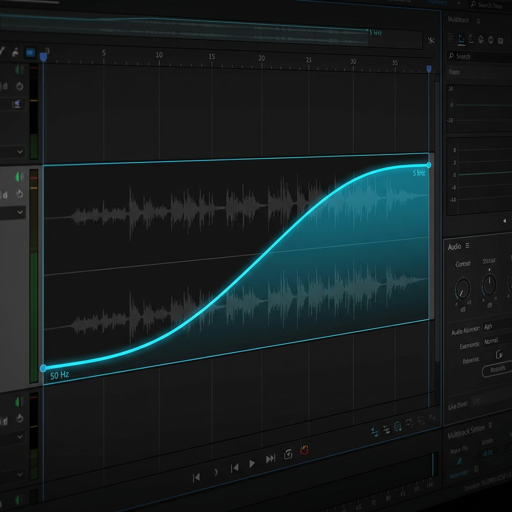
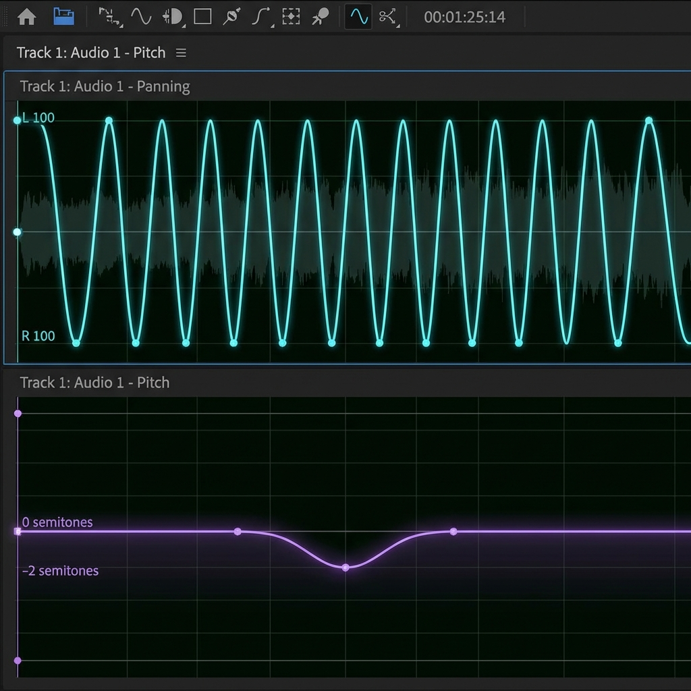
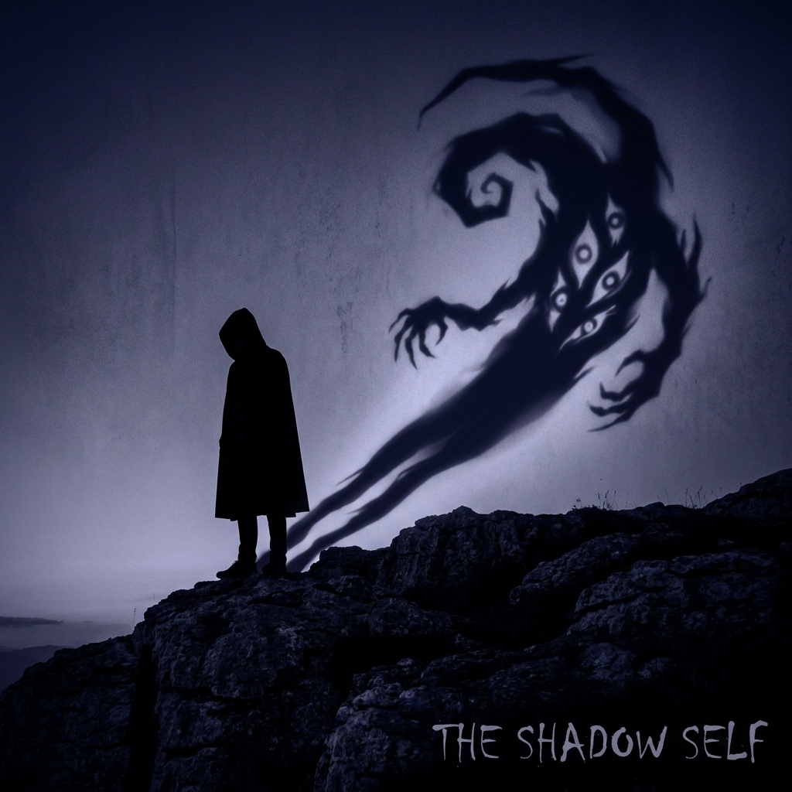

# Slide_Database (PPT 内容数据库)

> **Visual Style**: Cinematic, Minimalist Dark Mode, Waveform decorations.

---

## 📋 字段规范 (Field Specification)

每个 Slide 条目应包含以下字段:

| 字段 | 必填 | 说明 |
|:---|:---|:---|
| `Type` | ✅ | 类型标签: `[Concept Art]`, `[UI Graphic]`, `[Motion Graphic]`, `[Live Demo]`, `[Stock/Reference]`, `[Diagram]` |
| `Action` | 🎬 | **(Demo Only)** 具体操作步骤指令 (Storyboard) |
| `Target` | 🎬 | **(Demo Only)** 操作对象 (e.g. "Track 4 Automation Lane") |
| `Duration`| 🎬 | **(Demo Only)** 预计时长 (e.g. "~5s") |
| `Concept` | ✅ | 概念关键词 (中英文) |
| `Visual` | ✅ | 视觉描述 (中文,用于理解) |
| `Search` | 🔍 | 网络搜索关键词 (英文) |
| `AI_Prompt` | 🎨 | 文生图 Prompt (英文,含风格词) |
| `Caption` | 可选 | PPT 上显示的引用/注释 |
| `Text` | 可选 | PPT 上的主标题 |
| `List` | 可选 | PPT 上的列表内容 |

### 🎨 AI_Prompt 模板

```
[主体描述], [风格词], [画质词], [光照词], [构图词]

示例:
"A translucent ghost bird made of digital noise artifacts, floating in pure black void, 
glitch art style, 8K, cinematic lighting, centered composition"
```

### 🔍 Search 模板

```
[主体] [形容词] [场景/背景] site:unsplash.com OR site:pexels.com

示例:
"sound wave visualization abstract dark background site:unsplash.com"
```

---

## S01_Title
*   **Type**: [UI Graphic]
*   **Text**: 声音的魔术师：Audition 混响与特效实战
*   **Sub**: 智慧课程《数字音频处理》第五章 (Part 2) | 主讲：林昕
*   **Visual**: Audition Logo + Static Soundwave (No Animation).

## S02_BadCase
*   **Type**: [UI Graphic]
*   **Text**: 常见的声音瑕疵
*   **List**:
    *   Hum (嗡嗡声) -> 6.6.7
    *   Click (爆音) -> 6.6.5
    *   **Hiss (宽频底噪) -> 6.6.2 (Today's Focus)**
*   **Visual**: A waveform with red circles highlighting the "dirty" parts.
    *   **Ref**: 


## S02b_Toolbox_Flash
*   **Type**: [UI Graphic]
*   **Text**: 声音特效武器库 (Know-How)
*   **List**:
    *   Doppler Shifter (多普勒) -> 6.8.2: 模拟速度感
    *   Guitar Suite (吉他包) -> 6.8.4: 模拟失真/过载
    *   Center Channel Extractor (中置提取) -> 6.9.1: 消除/保留人声
*   **Visual**: Grid of icons representing these tools.

## S03_Concept_Source_Space_Ear (Core Model)
*   **Type**: [Diagram]
*   **Text**: 空间建模三要素
*   **Visual Diagram**:
    *   `[Sound Source/Actor]` ---> `[Box/Space]` ---> `[Ear/Listener]`
*   **Metaphor**: 声音是演员，混响是舞台，声像的观众席。


## S06_Ghost_Math (Metaphor)
*   **Type**: [Concept Art]
*   **Concept**: 修复的代价 (Musical Noise)
*   **Visual**: 一个半透明的、充满噪点的幽灵鸟（Birdies/Artifacts）漂浮在纯黑的背景中。隐喻：过度降噪产生的“数字幽灵”。
*   **Search**: `glitch ghost bird digital artifacts, transparent, pure black void background`
*   **AI_Prompt**: `A translucent ghost bird made of digital noise artifacts and glitch patterns, floating in pure black void, the bird is semi-transparent with visible pixel distortions and audio waveform textures, ethereal and haunting atmosphere, glitch art style, 8K, soft glow lighting, centered composition`
*   **Ref Image**: A semi-transparent "Ghost Bird" (Artifacts) floating in a void.
*   **Caption**: "过度寻求纯净，会召唤出'数字幽灵' (Musical Noise)。"
*   **Metaphor**: 那些被误删的声音灵魂。

## S07_Demonstration (Action)
*   **Type**: [UI Composite]
*   **Concept**: 降噪参数组合拳 (The Combo)
*   **Visual**: Split Screen Design.
    *   **Left**: Audition Noise Reduction Panel (Highlight: 75% Reduction, 30dB).
    *   **Right**: Dennis Gabor's Information Diagram (Hand-drawn style).
*   **Caption**: "在 4096 个频率切片中，寻找信号与噪声的边界。"

## S08_Visual_Alice_Drink (Metaphor)
*   **Type**: [Concept Art]
*   **Concept**: 塑形与变形 (Sculpt)
*   **Visual**: 爱丽丝喝下药水后身体开始变形的瞬间,音频波形与身体轮廓融合
*   **Search**: `Alice in Wonderland drinking potion transformation, surreal, dark fantasy`
*   **AI_Prompt**: `Alice in Wonderland drinking a glowing potion, her body transforming and stretching, audio waveforms merging with her silhouette, dark fantasy surreal style, Tim Burton aesthetic, deep purple and blue tones, 8K, cinematic dramatic lighting, centered composition`
*   **Ref Image**: *Alice in Wonderland* (1951 or 2010), Alice drinking the potion / Giant Alice.
*   **Caption**: "通过变调 (Pitch)，我们改变的不是声音，是角色的物理形态。"

## S07b_Ugly_Duckling
*   **Type**: [Metaphor]
*   **Concept**: 声音的尸体
*   **Visual**: Tiny waveform in a vast black void.
*   **Caption**: "The Ugly Duckling: High-pitched, No Body, Nervous."

## S08b_Tape_Machine
*   **Type**: [Animation]
*   **Concept**: 克洛诺斯的诅咒 (Time/Pitch)
*   **Visual**: Old Reel-to-Reel Tape machine spinning erratically.
*   **Text**: Speed ↑ = Pitch ↑ = Time ↓

## S08c_Pierre_Schaeffer
*   **Type**: [Photo/Historical]
*   **Concept**: 声音对象 (Sound Object)
*   **Visual**: Photo of Pierre Schaeffer (1948) operating turntables.
*   **Text**: "Acousmatic: The sound one hears without seeing the causes behind it."

## S08d_Chipmunk
*   **Type**: [Photo/Historical]
*   **Concept**: 花栗鼠效应
*   **Visual**: Photo of Ross Bagdasarian (1958) with Alvin and the Chipmunks.
*   **Caption**: "Warning: The Chipmunk Trap."

## S08e_Cello_Body
*   **Type**: [Diagram]
*   **Concept**: 共振峰 (Formant)
*   **Visual**: Split image. Left: Vocal Folds (Strings). Right: Cello Body (Vocal Tract).
*   **Highlight**: The "Body" remains constant while "Strings" stretch.

## S08f_Deep_Listening_Body_Soul
*   **Type**: [Text/Minimalist]
*   **Concept**: 深听时刻
*   **Visual**: Pure Black Screen.
*   **Text**: Body vs Soul.

## S11_Visual_RabbitHole (Metaphor)
*   **Type**: [Concept Art]
*   **Concept**: 空间置景 (Space)
*   **Ref Image**: Alice falling down the deep rabbit hole.
*   **Caption**: "混响定义了‘无底深渊’的深度。"

## S11b_Tail_Timer (Visual Aid)
*   **Type**: [Motion Graphic]
*   **Concept**: 捕捉尾音 (Catching the Tail)
*   **Visual**: A high-contrast "Stopwatch" or Digital Counter.
*   **Action**: Counts up from 0s to 5s... then fades out as the sound disappears.
*   **Goal**: Visualize the decay time for the audience.

## S10_Concept_Dry_Wet
*   **Type**: [Diagram/Comparison]
*   **Concept**: 空间的迷思
*   **Visual**: Split Screen.
    *   Left: "Dry: Proximity" (Alice stuck on screen surface).
    *   Right: "Wet: Infinity" (Alice falling into screen depth).

## S11c_Balloon_Cave
*   **Type**: [Diagram]
*   **Concept**: 脉冲响应 (IR)
*   **Visual**: Hand-drawn diagram of a balloon exploding in a cave, showing reflection paths.
*   **Text**: "Impulse Response: The DNA of Space".

## S12_Damping_Curve
*   **Type**: [Chart]
*   **Concept**: 高频阻尼 (Physics)
*   **Visual**: Frequency Response Curve collapsing at high frequencies (Low Pass).
*   **Metaphor**: Diver diving deep, red light disappearing.

## S13_Automation_Dissolution
*   **Type**: [UI/Screenshot]
*   **Concept**: 灵魂出窍
*   **Visual**: Multitrack Envelope Automation.
*   **Curve**: Blue line rising from 0% to 75%.
*   **Text**: "Dissolution".

## S14_Visual_Inception (Metaphor)
*   **Type**: [Stock/Reference]
*   **Concept**: 空间折叠/定位 (Position)
*   **Ref Image**: *Inception* (City folding up).
*   **Caption**: "立体声扩展 (Stereo Expand) 让现实扭曲，创造包裹感。"
*   **Overlay**: Animated headphone icon + Radial Spectrum extending left/right.

## S16_Summary_Loop
*   **Type**: [Diagram]
*   **Concept**: 剧场谢幕
*   **Diagram**: Circle Flow
    1.  Purify (此在)
    2.  Sculpt (彼在)
    3.  Space (何处)
    4.  Position (何方)
*   **Text**: 每一个参数，都是一种立场。


## S19_Murch_Rule_of_Six
*   **Type**: [Diagram]
*   **Concept**: 剪辑六法则 (Philosophy)
*   **Visual**: A Pyramid Diagram.
    1.  **Emotion (51%)** - Top
    2.  **Story (23%)**
    3.  **Rhythm (10%)**
    4.  **Eye Trace (7%)**
    5.  **2D Plane (5%)**
    6.  **3D Space (4%)**
*   **Highlight**: "Emotion" is the biggest block.

## S17_Homework
*   **Type**: [Task Card]
*   **Title**: 课后挑战：逃离麦克风 (Escape the Mic)
*   **Task**: 录制一段干声，利用四步法（净化-塑形-置景-定位）将其“异化”。
*   **Requirement**: 提交 MP3 + 200字创作说明（解释你的导演决策）。

---

## S02_Voss_Clarke
*   **Type**: [Diagram/Historical]
*   **Concept**: 1/f 噪音
*   **Visual**: Pink Noise spectrum vs Bach Concerto spectrum.
*   **Text**: "The 1/f Law: Nature's Heartbeat".
*   **Graphic**: Correlation graph from Voss & Clarke (1975).

## S04_Inchindown_Tanks
*   **Type**: [Photo/Historical]
*   **Concept**: 混响极限
*   **Visual**: Photo of the Inchindown Oil Tanks interior (Endless Tunnel).
*   **Caption**: "World Record: 112 Seconds of Reverb."
*   **Text**: "The Inchindown Limit".

## S04_Alvin_Lucier
*   **Type**: [Photo/Historical]
*   **Concept**: 空间作为乐器
*   **Visual**: Photo of Alvin Lucier sitting in a room with a microphone.
*   **Text**: "I am sitting in a room..."

## S04_Neubauten
*   **Type**: [Photo/Band]
*   **Concept**: 工业深渊
*   **Visual**: Einstürzende Neubauten banging on metal pipes in a highway underpass.
*   **Caption**: "Finding tone in the industrial noise."

## S04_UI_HardLimiter
*   **Type**: [UI/Screenshot]
*   **Concept**: 安全网
*   **Visual**: Hard Limiter Panel.
*   **Settings**: Max Amplitude = -0.1dB.
*   **Overlay**: Green text "SAFE".

## S04_Conclusion_Abyss
*   **Type**: [Concept Art]
*   **Concept**: 听见深渊
*   **Visual**: Alice floating in a vast, dark, cylindrical tank (The Oil Tank).
*   **Caption**: "All knobs serve the 80ms of terror."

## S05_Blumlein_Walking
*   **Type**: [Photo/Historical]
*   **Concept**: 立体声行走
*   **Visual**: Alan Blumlein walking in front of a microphone pair at Abbey Road (1933).
*   **Text**: "Testing Presence, not just Wire."
*   **Caption**: "On this day in 1931, EMI engineer Alan Dower Blumlein filed a patent for a two-channel audio system, or what we now know as ‘Stereo’."


## S05_Fantasound_Layout
*   **Type**: [Diagram]
*   **Concept**: 原始的自动化
*   **Visual**: The 1940 Fantasound Speaker Layout + The "Tadpole" optical track.
*   **Caption**: "The Ancestor of Automation."

## S05_UI_The_Wall
*   **Type**: [UI/Screenshot]
*   **Concept**: 压迫之墙 (ILD)
*   **Visual**: Automation Lane for Low Pass Filter.
*   **Curve**: Rising from 50Hz to 5000Hz (Opening the gate).
*   **Ref**: 


## S05_UI_The_Needle
*   **Type**: [UI/Screenshot]
*   **Concept**: 焦虑之刺 (Doppler)
*   **Visual**: Automation Lane for Pan + Pitch.
*   **Curve**: Pan = Fast Sine Wave; Pitch = Tiny dip (-50 cents) at center.
*   **Ref**: 


## S05_Jungian_Shadow
*   **Type**: [Concept Art]
*   **Concept**: 荣格阴影
*   **Visual**: A silhouette of a person casting a shadow that is a different monster/shape.
*   **Text**: "The Shadow: The rejected self."
*   **Ref**: 


## S05_Azimuth_Coordinator
*   **Type**: [Photo/Historical]
*   **Concept**: 方位协调器
*   **Visual**: Photo of the joystick device used by Pink Floyd.
*   **Caption**: "Surround Sound in 1972."

## S05_Janet_Cardiff
*   **Type**: [Photo/Art]
*   **Concept**: 声音雕塑
*   **Visual**: The 40 Speakers arranged in an oval for "The Forty Part Motet".
*   **Text**: "Sound as Sculpture."

## S05_Geometry_Loneliness
*   **Type**: [Concept Art]
*   **Concept**: 孤独的几何学
*   **Visual**: Abstract geometry connecting the Wall, the Needle, and the Void.
*   **Text**: "The Geometry of Loneliness."
*   **Ref**: 


## S05_Act_Draw_Filter
*   **Type**: [Live Demo]
*   **Target**: Track 4 Automation Lane (Parametric EQ)
*   **Action**: 绘制 Low Pass Filter 曲线 (Approaching Wedge)。频率从 50Hz (潜意识) 平滑上升至 5000Hz (现实逼近)。
*   **Duration**: ~10s
*   **Caption**: "The Wall is opening."

## S05_Act_Perform_Pan
*   **Type**: [Live Demo]
*   **Target**: Track 5 Pan Automation Lane
*   **Action**: (Write Mode) 随着节奏疯狂、不规则地左右摇摆声像旋钮，模拟焦虑的心电图。
*   **Duration**: ~10s
*   **Caption**: "Anxiety is not a Sine Wave."

## S05_Act_Add_Doppler
*   **Type**: [Live Demo]
*   **Target**: Track 5 Pitch Automation Lane
*   **Action**: 微调 Pitch 曲线。当 Pan 穿过 Center 时，Pitch 每个周期下降 -50 cents 再回弹。
*   **Duration**: ~5s
*   **Caption**: "Doppler Effect: The sound is flying OVER you."

## S05_Act_Max_Width
*   **Type**: [Live Demo]
*   **Target**: FX Bus (The Void) - Stereo Expander
*   **Action**: 将 Stereo Width 瞬间从 100% 推至 150%。
*   **Duration**: ~2s (Impact)
*   **Caption**: "Geometric Collapse."

