# Slide_Database (PPT 内容数据库)

> **Visual Style**: Cinematic, Minimalist Dark Mode, Waveform decorations.

---

## 📋 字段规范 (Field Specification)

每个 Slide 条目应包含以下字段:

| 字段 | 必填 | 说明 |
|:---|:---|:---|
| `Type` | ✅ | 类型标签: `[Concept Art]`, `[UI Graphic]`, `[Motion Graphic]`, `[Live Demo]`, `[Stock/Reference]`, `[Diagram]` |
| `Action` | 🎬 | **(Demo Only)** 具体操作步骤指令 (Storyboard) |
| `Target` | 🎬 | **(Demo Only)** 操作对象 (e.g. "Track 4 Automation Lane") |
| `Duration`| 🎬 | **(Demo Only)** 预计时长 (e.g. "~5s") |
| `Concept` | ✅ | 概念关键词 (中英文) |
| `Visual` | ✅ | 视觉描述 (中文,用于理解) |
| `Search` | 🔍 | 网络搜索关键词 (英文) |
| `AI_Prompt` | 🎨 | 文生图 Prompt (英文,含风格词) |
| `Caption` | 可选 | PPT 上显示的引用/注释 |
| `Text` | 可选 | PPT 上的主标题 |
| `List` | 可选 | PPT 上的列表内容 |
| `MediaStart`| 🎬 | (Video) 开始时间 (seconds) |
| `MediaEnd`  | 🎬 | (Video) 结束时间 (seconds) |

### 🎨 AI_Prompt 模板

```
[主体描述], [风格词], [画质词], [光照词], [构图词]

示例:
"A translucent ghost bird made of digital noise artifacts, floating in pure black void, 
glitch art style, 8K, cinematic lighting, centered composition"
```

### 🔍 Search 模板

```
[主体] [形容词] [场景/背景] site:unsplash.com OR site:pexels.com

示例:
"sound wave visualization abstract dark background site:unsplash.com"
```

---

## S01_Title
*   **Type**: [UI Graphic]
*   **Text**: 声音的魔术师：Audition 混响与特效实战
*   **Sub**: 智慧课程《数字音频处理》第五章 (Part 2) | 主讲：林昕
*   **Visual**: Audition Logo + Static Soundwave (No Animation).

## S02_BadCase
*   **Type**: [UI Graphic]
*   **Text**: 常见的声音瑕疵
*   **List**:
    *   Hum (嗡嗡声) -> 6.6.7
    *   Click (爆音) -> 6.6.5
    *   **Hiss (宽频底噪) -> 6.6.2 (Today's Focus)**
*   **Visual**: A waveform with red circles highlighting the "dirty" parts.
    *   **Ref**: 


## S02b_Toolbox_Flash
*   **Type**: [UI Graphic]
*   **Text**: 声音特效武器库 (Know-How)
*   **List**:
    *   Doppler Shifter (多普勒) -> 6.8.2: 模拟速度感
    *   Guitar Suite (吉他包) -> 6.8.4: 模拟失真/过载
    *   Center Channel Extractor (中置提取) -> 6.9.1: 消除/保留人声
*   **Visual**: Grid of icons representing these tools.

## S03_Concept_Source_Space_Ear (Core Model)
*   **Type**: [Diagram]
*   **Text**: 空间建模三要素
*   **Visual Diagram**:
    *   `[Sound Source/Actor]` ---> `[Box/Space]` ---> `[Ear/Listener]`
*   **Metaphor**: 声音是演员，混响是舞台，声像的观众席。


## S02_Ghost_Math (Metaphor)
*   **Type**: [Concept Art]
*   **Concept**: 修复的代价 (Musical Noise)
*   **Visual**: 一个半透明的、充满噪点的幽灵鸟（Birdies/Artifacts）漂浮在纯黑的背景中。隐喻：过度降噪产生的“数字幽灵”。
*   **Search**: `glitch ghost bird digital artifacts, transparent, pure black void background`
*   **AI_Prompt**: `A translucent ghost bird made of digital noise artifacts and glitch patterns, floating in pure black void, the bird is semi-transparent with visible pixel distortions and audio waveform textures, ethereal and haunting atmosphere, glitch art style, 8K, soft glow lighting, centered composition`
*   **Ref Image**: A semi-transparent "Ghost Bird" (Artifacts) floating in a void.
*   **Caption**: "过度寻求纯净，会召唤出'数字幽灵' (Musical Noise)。"
*   **Metaphor**: 那些被误删的声音灵魂。

## S02_Demonstration (Action)
*   **Type**: [UI Composite]
*   **Concept**: 降噪参数组合拳 (The Combo)
*   **Visual**: Split Screen Design.
    *   **Left**: Audition Noise Reduction Panel (Highlight: 75% Reduction, 30dB).
    *   **Right**: Dennis Gabor's Information Diagram (Hand-drawn style).
*   **Caption**: "在 4096 个频率切片中，寻找信号与噪声的边界。"

## S03_Visual_Alice_Drink (Metaphor)
*   **Type**: [Concept Art]
*   **Concept**: 塑形与变形 (Sculpt)
*   **Visual**: 爱丽丝喝下药水后身体开始变形的瞬间,音频波形与身体轮廓融合
*   **Search**: `Alice in Wonderland drinking potion transformation, surreal, dark fantasy`
*   **AI_Prompt**: `Alice in Wonderland drinking a glowing potion, her body transforming and stretching, audio waveforms merging with her silhouette, dark fantasy surreal style, Tim Burton aesthetic, deep purple and blue tones, 8K, cinematic dramatic lighting, centered composition`
*   **Ref Image**: *Alice in Wonderland* (1951 or 2010), Alice drinking the potion / Giant Alice.
*   **Caption**: "通过变调 (Pitch)，我们改变的不是声音，是角色的物理形态。"

## S02_Ugly_Duckling
*   **Type**: [Metaphor]
*   **Concept**: 声音的尸体
*   **Visual**: Tiny waveform in a vast black void.
*   **Caption**: "The Ugly Duckling: High-pitched, No Body, Nervous."

## S03_Tape_Machine
*   **Type**: [Animation]
*   **Concept**: 克洛诺斯的诅咒 (Time/Pitch)
*   **Visual**: Old Reel-to-Reel Tape machine spinning erratically.
*   **Text**: Speed ↑ = Pitch ↑ = Time ↓

## S03_Pierre_Schaeffer
*   **Type**: [Photo/Historical]
*   **Concept**: 声音对象 (Sound Object)
*   **Visual**: Photo of Pierre Schaeffer (1948) operating turntables.
*   **Text**: "Acousmatic: The sound one hears without seeing the causes behind it."

## S03_Chipmunk
*   **Type**: [Photo/Historical]
*   **Concept**: 花栗鼠效应
*   **Visual**: Photo of Ross Bagdasarian (1958) with Alvin and the Chipmunks.
*   **Caption**: "Warning: The Chipmunk Trap."

## S03_Cello_Body
*   **Type**: [Diagram]
*   **Concept**: 共振峰 (Formant)
*   **Visual**: Split image. Left: Vocal Folds (Strings). Right: Cello Body (Vocal Tract).
*   **Highlight**: The "Body" remains constant while "Strings" stretch.

## S03_Deep_Listening
*   **Type**: [Text/Minimalist]
*   **Concept**: 深听时刻
*   **Visual**: Pure Black Screen.
*   **Text**: Body vs Soul.

## S04_Visual_RabbitHole (Metaphor)
*   **Type**: [Concept Art]
*   **Concept**: 空间置景 (Space)
*   **Ref Image**: Alice falling down the deep rabbit hole.
*   **Caption**: "混响定义了‘无底深渊’的深度。"

## S04_Tail_Timer (Visual Aid)
*   **Type**: [Motion Graphic]
*   **Concept**: 捕捉尾音 (Catching the Tail)
*   **Visual**: A high-contrast "Stopwatch" or Digital Counter.
*   **Action**: Counts up from 0s to 5s... then fades out as the sound disappears.
*   **Goal**: Visualize the decay time for the audience.

## S04_Concept_Dry_Wet
*   **Type**: [Diagram/Comparison]
*   **Concept**: 空间的迷思
*   **Visual**: Split Screen.
    *   Left: "Dry: Proximity" (Alice stuck on screen surface).
    *   Right: "Wet: Infinity" (Alice falling into screen depth).

## S04_Balloon_Cave
*   **Type**: [Diagram]
*   **Concept**: 脉冲响应 (IR)
*   **Visual**: Hand-drawn diagram of a balloon exploding in a cave, showing reflection paths.
*   **Text**: "Impulse Response: The DNA of Space".

## S04_Damping_Curve
*   **Type**: [Chart]
*   **Concept**: 高频阻尼 (Physics)
*   **Visual**: Frequency Response Curve collapsing at high frequencies (Low Pass).
*   **Metaphor**: Diver diving deep, red light disappearing.

## S04_Automation_Dissolution
*   **Type**: [UI/Screenshot]
*   **Concept**: 灵魂出窍
*   **Visual**: Multitrack Envelope Automation.
*   **Curve**: Blue line rising from 0% to 75%.
*   **Text**: "Dissolution".

## S05_Visual_Inception (Metaphor)
*   **Type**: [Concept Art]
*   **Concept**: 空间折叠/定位 (Position)
*   **Visual**: A surreal cityscape folding upwards on both sides (Inception style), representing the "Stereo Expand" effect wrapping reality around the listener.
*   **Dimensions**: 1920x1080 (16:9)
*   **AI_Prompt**: `Cinematic shot of a city folding onto itself, inception movie style bending reality, architectural surrealism, dark moody atmosphere, deep teal and orange color grading, wide angle lens, 8k resolution, highly detailed, dramatic lighting, volumetric fog, symmetry`
*   **Caption**: "立体声扩展 (Stereo Expand) 让现实扭曲，创造包裹感。"
*   **Overlay**: Animated headphone icon + Radial Spectrum extending left/right.

## S06_Summary_Loop
*   **Type**: [Diagram]
*   **Concept**: 剧场谢幕
*   **Diagram**: Circle Flow
    1.  Purify (此在)
    2.  Sculpt (彼在)
    3.  Space (何处)
    4.  Position (何方)
*   **Text**: 每一个参数，都是一种立场。


## S06_Murch_Rule_of_Six
*   **Type**: [Diagram]
*   **Concept**: 剪辑六法则 (Philosophy)
*   **Visual**: A Pyramid Diagram.
    1.  **Emotion (51%)** - Top
    2.  **Story (23%)**
    3.  **Rhythm (10%)**
    4.  **Eye Trace (7%)**
    5.  **2D Plane (5%)**
    6.  **3D Space (4%)**
*   **Highlight**: "Emotion" is the biggest block.

## S06_Homework
*   **Type**: [Task Card]
*   **Title**: 课后挑战：逃离麦克风 (Escape the Mic)
*   **Task**: 录制一段干声，利用四步法（净化-塑形-置景-定位）将其“异化”。
*   **Requirement**: 提交 MP3 + 200字创作说明（解释你的导演决策）。

---

## S02_Voss_Clarke
*   **Type**: [Diagram/Historical]
*   **Concept**: 1/f 噪音
*   **Visual**: Pink Noise spectrum vs Bach Concerto spectrum.
*   **Text**: "The 1/f Law: Nature's Heartbeat".
*   **Graphic**: Correlation graph from Voss & Clarke (1975).

## S04_Inchindown_Tanks
*   **Type**: [Photo/Historical]
*   **Concept**: 混响极限
*   **Visual**: Photo of the Inchindown Oil Tanks interior (Endless Tunnel).
*   **Caption**: "World Record: 112 Seconds of Reverb."
*   **Text**: "The Inchindown Limit".

## S04_Alvin_Lucier
*   **Type**: [Photo/Historical]
*   **Concept**: 空间作为乐器
*   **Visual**: Photo of Alvin Lucier sitting in a room with a microphone.
*   **Text**: "I am sitting in a room..."

## S04_Neubauten
*   **Type**: [Photo/Band]
*   **Concept**: 工业深渊
*   **Visual**: Einstürzende Neubauten banging on metal pipes in a highway underpass.
*   **Caption**: "Finding tone in the industrial noise."

## S04_UI_HardLimiter
*   **Type**: [UI/Screenshot]
*   **Concept**: 安全网
*   **Visual**: Hard Limiter Panel.
*   **Settings**: Max Amplitude = -0.1dB.
*   **Overlay**: Green text "SAFE".

## S04_Conclusion_Abyss
*   **Type**: [Concept Art]
*   **Concept**: 听见深渊
*   **Visual**: Alice floating in a vast, dark, cylindrical tank (The Oil Tank).
*   **Caption**: "All knobs serve the 80ms of terror."

## S05_Blumlein_Walking
*   **Type**: [Photo/Historical]
*   **Concept**: 立体声行走
*   **Visual**: Alan Blumlein walking in front of a microphone pair at Abbey Road (1933).
*   **Text**: "Testing Presence, not just Wire."
*   **Caption**: "On this day in 1931, EMI engineer Alan Dower Blumlein filed a patent for a two-channel audio system, or what we now know as ‘Stereo’."
*   **Ref**: 

## S05_Diff_Material_Preview
*   **Type**: [Video]
*   **Concept**: 深听测试 (Deep Listening)
*   **MediaStart**: 6.82
*   **MediaEnd**: 21.715
*   **Visual**: Screen recording of the audio process.
*   **Ref**: 

## S05_Audition_Check
*   **Type**: [UI/Icon]
*   **Concept**: 听觉检查
*   **Visual**: Minimalist icon of an ear or headphones, pulsating slightly.
*   **Text**: "Audition Check"
*   **Caption**: "Don't look. Listen."
*   **Ref**: 
*   **AI_Prompt**: `minimalist icon design, listening ear symbol, glowing cyan lines on black background, hud interface style, 8k`

## S05_Preview_Heart_Raw
*   **Type**: [Video]
*   **Concept**: 心跳原声预览
*   **Visual**: Screen recording of playing the raw Heartbeat audio.
*   **Ref**: 

## S05_Preview_Wall_Raw
*   **Type**: [Video]
*   **Concept**: 压力原声预览
*   **Visual**: Screen recording of playing the raw Pressure audio.
*   **Ref**: 

## S05_Preview_Needle_Raw
*   **Type**: [Video]
*   **Concept**: 焦虑原声预览
*   **Visual**: Screen recording of playing the raw Anxiety audio.
*   **Ref**: 

## S05_Preview_Wall_Final
*   **Type**: [Video]
*   **Concept**: 墙体最终效果预览
*   **Visual**: Screen recording of the processed Wall audio impact.
*   **Ref**: 

## S05_Preview_Needle_Final
*   **Type**: [Video]
*   **Concept**: 针刺最终效果预览
*   **Visual**: Screen recording of the processed Needle audio flyover.
*   **Ref**: 


## S05_Fantasound_Layout
*   **Type**: [Diagram]
*   **Concept**: 原始的自动化
*   **Visual**: The 1940 Fantasound Speaker Layout + The "Tadpole" optical track.
*   **Caption**: "The Ancestor of Automation."
*   **Ref**: 

## S05_Setup_Surround_NewSession
*   **Type**: [UI/Screenshot]
*   **Concept**: 5.1 环境设置
*   **Visual**: New Multitrack Session Dialog with "5.1 Surround" highlighted.
*   **Ref**: 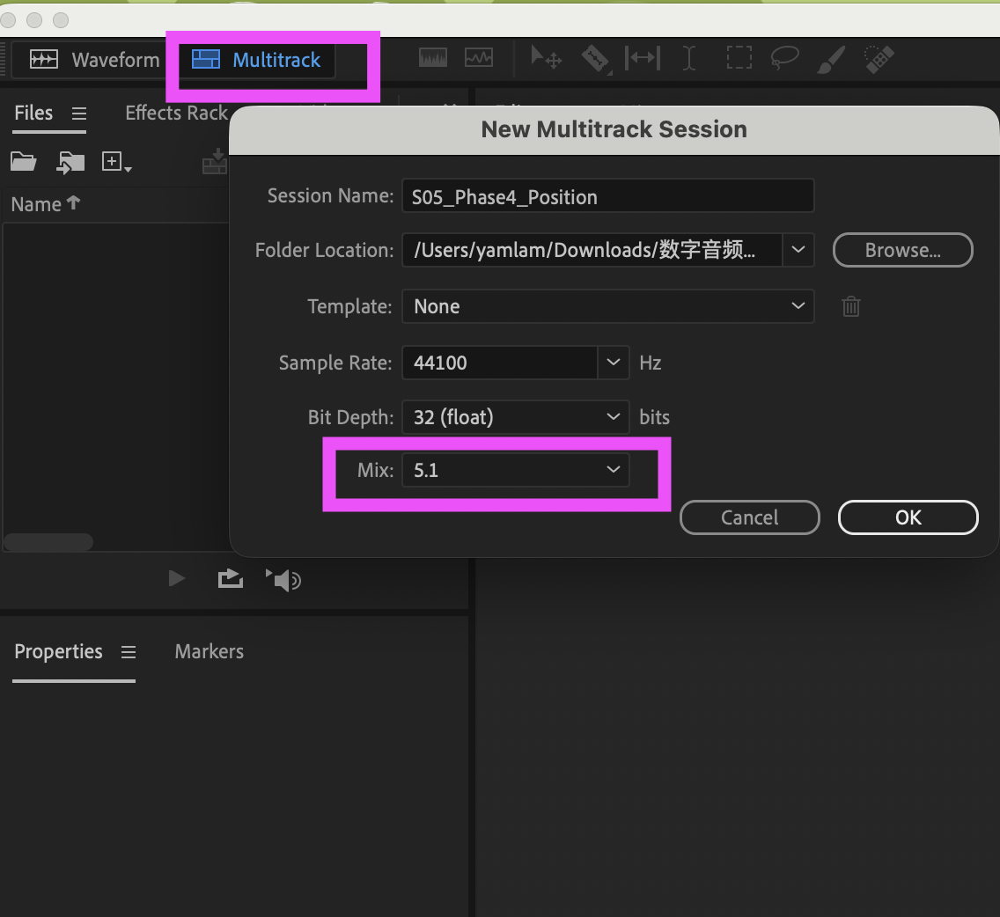

## S05_Add_Bus_RightClick
*   **Type**: [UI/Screenshot]
*   **Concept**: 右键添加总线
*   **Visual**: 在轨道空白处右键弹出菜单，显示 Track > Add Stereo Bus Track 的操作路径。
*   **Ref**: 

## S05_Setup_Bus_Creation
*   **Type**: [UI/Screenshot]
*   **Concept**: 创建总线
*   **Visual**: Multitrack View showing "Add Stereo Bus Track" menu action.
*   **Ref**: 

## S05_Setup_Bus_Reverb
*   **Type**: [UI/Screenshot]
*   **Concept**: 加载混响
*   **Visual**: Effect Rack on "The Void" bus showing Convolution Reverb loaded.
*   **Ref**: 

## S05_Setup_IR_Detail
*   **Type**: [UI/Screenshot]
*   **Concept**: 加载脉冲响应
*   **Visual**: Action of dragging/loading `asset_S04_void_ir.wav` into the plugin.
*   **Ref**: 

## S05_Setup_Import_Tracks
*   **Type**: [UI/Screenshot]
*   **Concept**: 导入素材与布局
*   **Visual**: Project showing the 3 actors (Heart, Wall, Needle) imported onto tracks.
*   **Ref**: 


## S05_Setup_Sends_Routing
*   **Type**: [UI/Screenshot]
*   **Concept**: 发送路由
*   **Visual**: Mixer View showing Sends to "The Void" at -3dB.
*   **Ref**: 

## S05_Setup_Surround_NewSession
*   **Type**: [UI/Screenshot]
*   **Concept**: 建立笼子
*   **Visual**: New Multitrack Session dialog selecting "5.1".
*   **Ref**: 

## S05_Wall_EQ_Start
*   **Type**: [UI/Screenshot]
*   **Concept**: 墙在远方
*   **Visual**: Parametric EQ at 2000Hz / -40dB (Muffled, distant).
*   **Ref**: 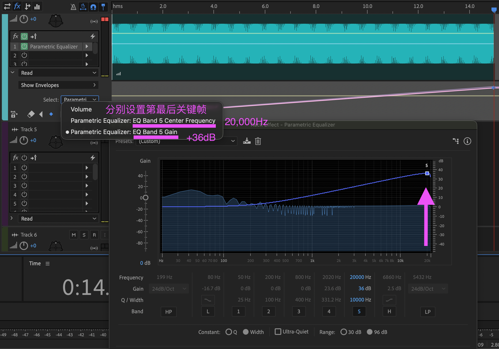

## S05_Automation_Curve
*   **Type**: [UI/Screenshot]
*   **Concept**: 蝌蚪的后裔
*   **Visual**: Close-up of an automation envelope line with keyframes, looking like a "tadpole" or biological curve.
*   **Ref**: 

## S05_Wall_EQ_End
*   **Type**: [UI/Screenshot]
*   **Concept**: 墙在眼前 (刺破)
*   **Visual**: Parametric EQ at 20,000Hz / +12dB (Impact, piercing).
*   **Ref**: 


## S05_Needle_Automation_Setup_cap
*   **Type**: [UI/Screenshot]
*   **Concept**: 焦虑之刺 (Setup)
*   **Visual**: Setup showing Pan Angle and Radius envelopes enabled for Track 3.
*   **Ref**: 

## S05_Needle_Pan_Angle_cap
*   **Type**: [UI/Screenshot]
*   **Concept**: 360度环绕
*   **Visual**: Pan Angle envelope moving from -180 to +180 degrees.
*   **Ref**: 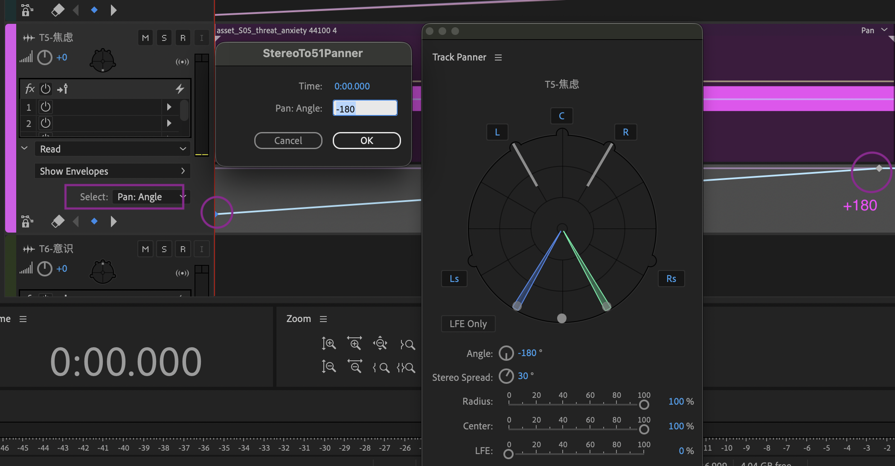

## S05_Needle_Pan_Radius_cap
*   **Type**: [UI/Screenshot]
*   **Concept**: 螺旋逼近
*   **Visual**: Pan Radius envelope dropping from 96% to 20%.
*   **Ref**: 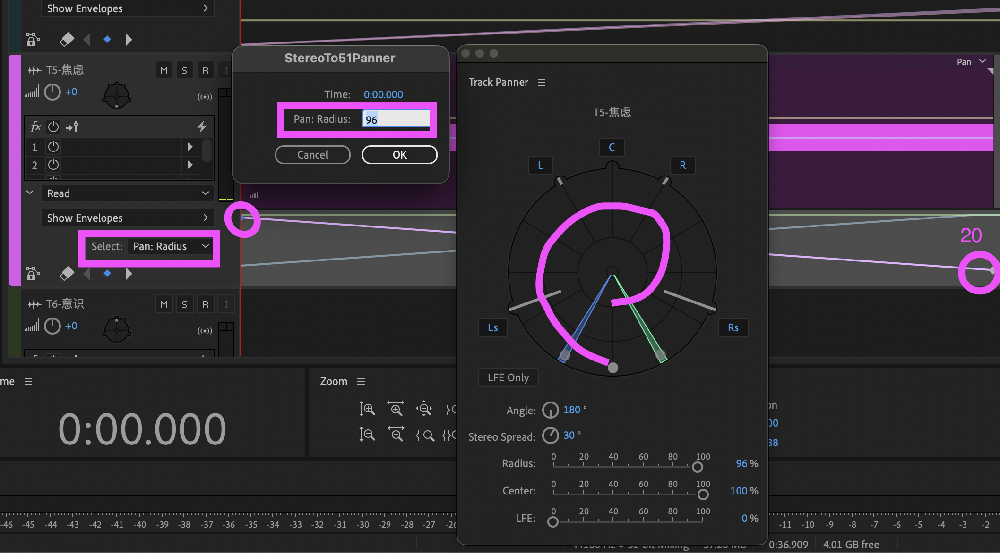

## S05_Needle_Pan_Random_cap
*   **Type**: [UI/Screenshot]
*   **Concept**: 随机不规则环绕
*   **Visual**: Spline curves showing chaotic/random pan movement.
*   **Ref**: 


## S05_Jungian_Shadow
*   **Type**: [Extension]
*   **Concept**: 荣格阴影
*   **Visual**: A silhouette of a person casting a shadow that is a different monster/shape.
*   **Text**: "The Shadow: The rejected self."
*   **Ref**: 


## S05_Ext_Shadow_Panner_cap
*   **Type**: [UI/Screenshot]
*   **Concept**: 阴影的位置 (Behind Head)
*   **Visual**: Pan Angle -179, Radius 17.
*   **Ref**: 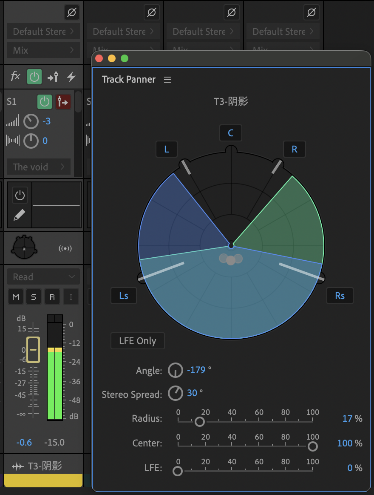

## S05_EQ_Automation_Setup_cap
*   **Type**: [UI/Screenshot]
*   **Concept**: 自动化曲线设置
*   **Visual**: Show Envelopes menu with "Band 5 Freq" and "Band 5 Gain" selected.
*   **Ref**: 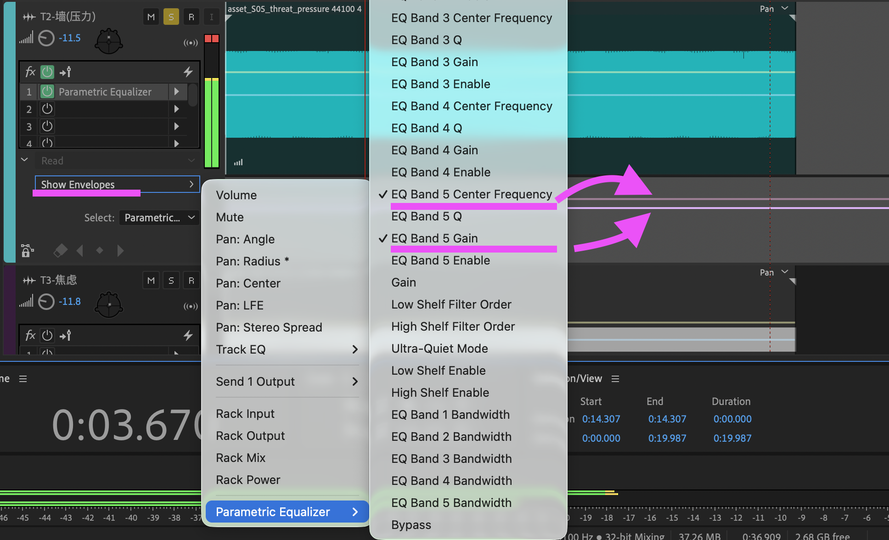

## S05_EQ_Automation_Curve_cap
*   **Type**: [UI/Screenshot]
*   **Concept**: 绘制滤波器曲线
*   **Visual**: Two automation lines: Freq rising from 2k to 20k, Gain rising from -40 to +12dB.
*   **Ref**: 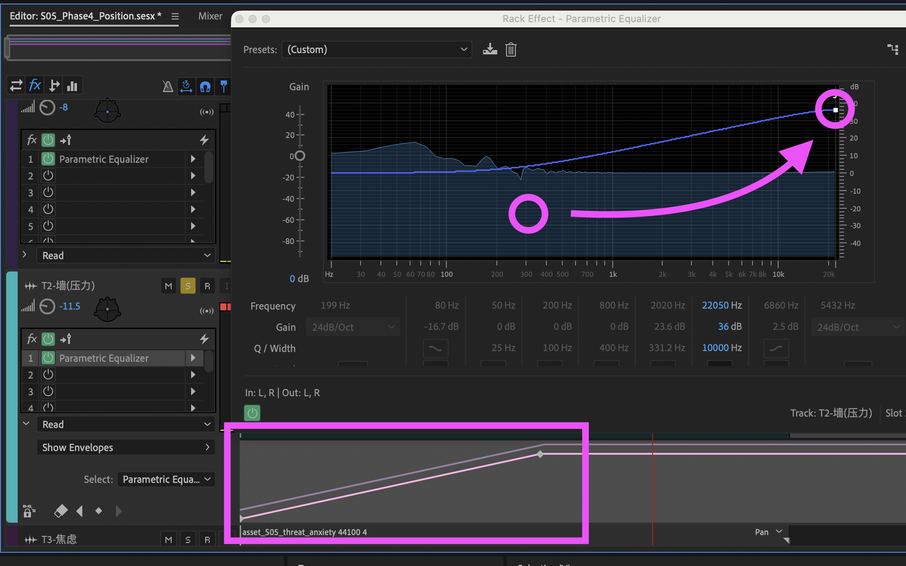

## S05_EQ_Final_View_cap
*   **Type**: [UI/Screenshot]
*   **Concept**: 最终EQ视图
*   **Visual**: The resulting automation curves on the track.
*   **Ref**: 

## S05_Pan_Radius_Toggle_cap
*   **Type**: [UI/Screenshot]
*   **Concept**: 启用半径参数
*   **Visual**: Show Envelopes menu with "Radius" selected for Track Panner.
*   **Ref**: 

## S05_Pan_Radius_Curve_cap
*   **Type**: [UI/Screenshot]
*   **Concept**: 墙体逼近
*   **Visual**: Radius automation curve dropping from high to low (Wall closing in).
*   **Ref**: 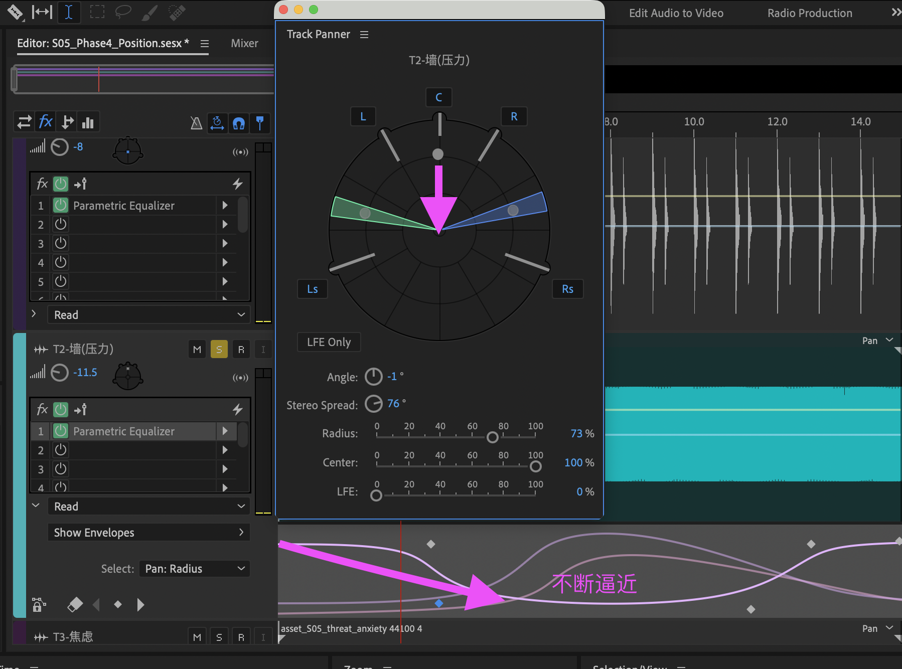


## S05_Azimuth_Coordinator
*   **Type**: [Photo/Historical]
*   **Concept**: 方位协调器
*   **Visual**: Photo of the joystick device used by Pink Floyd.
*   **Caption**: "Surround Sound in 1972."

## S05_Janet_Cardiff
*   **Type**: [Photo/Art]
*   **Concept**: 声音雕塑
*   **Visual**: The 40 Speakers arranged in an oval for "The Forty Part Motet".
*   **Text**: "Sound as Sculpture."

## S05_Geometry_Loneliness
*   **Type**: [Concept Art]
*   **Concept**: 孤独的几何学
*   **Visual**: Abstract geometry connecting the Wall, the Needle, and the Void.
*   **Text**: "The Geometry of Loneliness."
*   **Ref**: 


## S05_Act_Draw_Filter
*   **Type**: [Live Demo]
*   **Target**: Track 2 Automation Lane (Parametric EQ)
*   **Action**: 绘制 Low Pass Filter 曲线 (Approaching Wedge)。频率从 50Hz (潜意识) 平滑上升至 5000Hz (现实逼近)。
*   **Duration**: ~10s
*   **Caption**: "The Wall is opening."

## S05_Act_Perform_Pan
*   **Type**: [Live Demo]
*   **Target**: Track 3 Pan Automation Lane (Angle & Radius)
*   **Action**: (Draw Keyframes) 手动绘制 Spline 曲线，让 Angle 在 -180 到 +180 之间随机跳跃，Radius 逐渐减小。
*   **Duration**: ~15s
*   **Caption**: "Drawing the Anxiety with Splines."


*   **Type**: [Live Demo]
*   **Target**: FX Bus (The Void) - Stereo Expander
*   **Action**: 将 Stereo Width 瞬间从 100% 推至 150%。
*   **Duration**: ~2s (Impact)
*   **Caption**: "Geometric Collapse."

## S05_Void_EQ_Settings
*   **Type**: [UI/Screenshot]
*   **Concept**: 深渊EQ设置
*   **Visual**: Parametric EQ settings for The Void bus.
*   **Ref**: 

## S05_Void_Expander_Location
*   **Type**: [Extension]
*   **Concept**: Expander 效果器位置
*   **Visual**: Rack menu showing Stereo Imaging > Stereo Expander.
*   **Ref**: 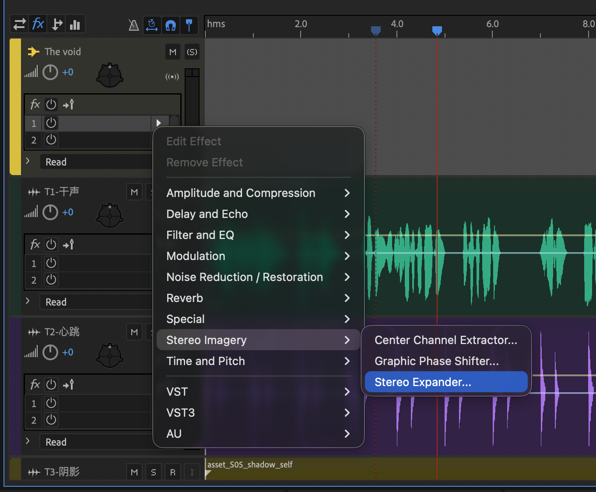

## S05_Void_Expander_Settings
*   **Type**: [UI/Screenshot]
*   **Concept**: 150% 宽度
*   **Visual**: Stereo Expander set to 150 (Extra Wide).
*   **Ref**: 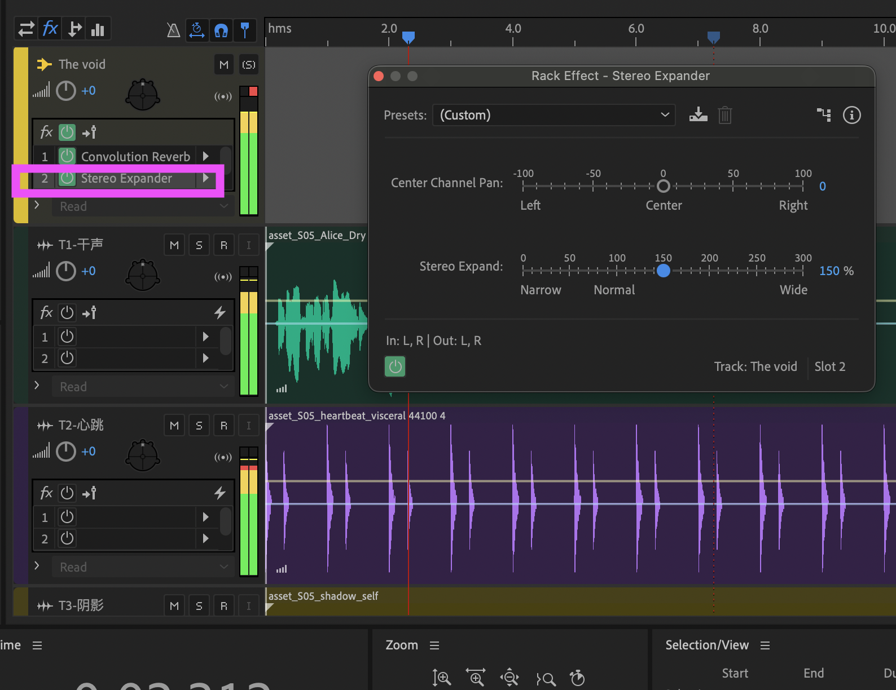


## S05_Heart_EQ_Add
*   **Type**: [UI/Screenshot]
*   **Concept**: 加载参数均衡器
*   **Visual**: 在 Track 1 的效果组合中加载 Parametric EQ 的菜单路径。
*   **Ref**: 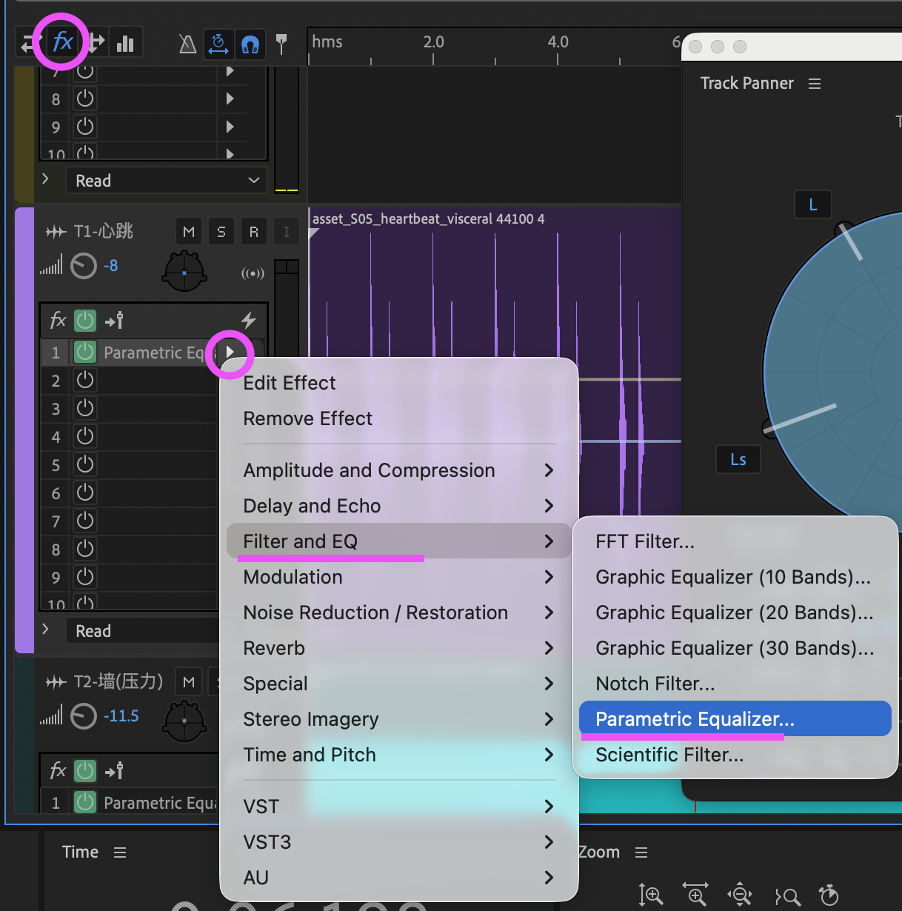

## S05_Heart_EQ_Settings_cap
*   **Type**: [UI/Screenshot]
*   **Concept**: 极致孤独 EQ
*   **Visual**: Parametric EQ: Low Pass 200Hz (48dB/Oct). Only sub-bass remains.
*   **Ref**: 

## S05_Heart_Panner_Open
*   **Type**: [UI/Screenshot]
*   **Concept**: 打开声像面板
*   **Visual**: 轨道控制区 T1-心跳，圆点图标被紫色圆圈圈住，标注“双击”。同时展示声像面板及其参数含义（Angle, Spread, Radius, Center, LFE）。
*   **Ref**: 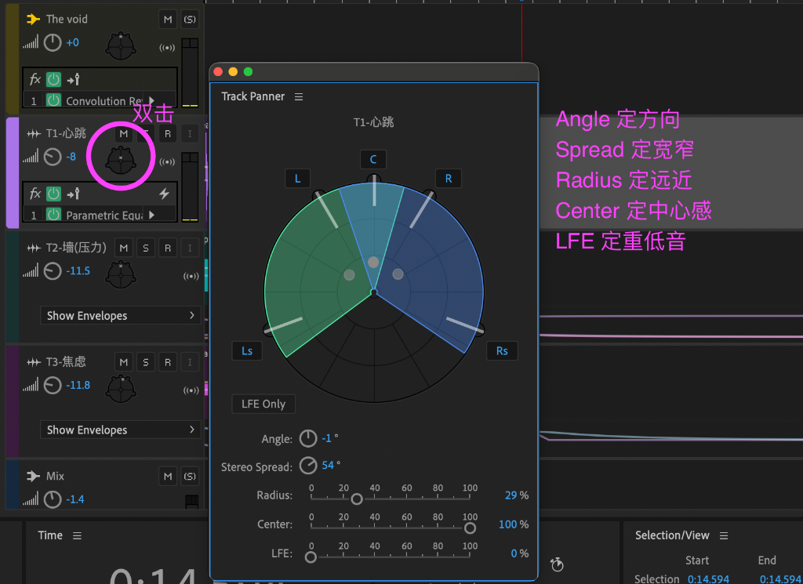

## S05_Heart_Panner_Settings
*   **Type**: [UI/Screenshot]
*   **Concept**: 心脏声像 (Diffusion)
*   **Visual**: Track Panner: Radius 0, Stereo Spread 30 degrees.
*   **Ref**: 

## S05_Ext_Shadow_Panner_cap
*   **Type**: [Extension/Screenshot]
*   **Concept**: 脑后低语 (Behind Head)
*   **Visual**: Track Panner: Angle -179, Radius 17 (Very Close).
*   **Ref**: 
## S05_Setup_HardLimiter
*   **Type**: [UI/Screenshot]
*   **Concept**: 物理保险 (Hard Limiter)
*   **Visual**: Hard Limiter panel on Mix track, set to -3.0 dB Maximum Amplitude.
*   **Ref**: 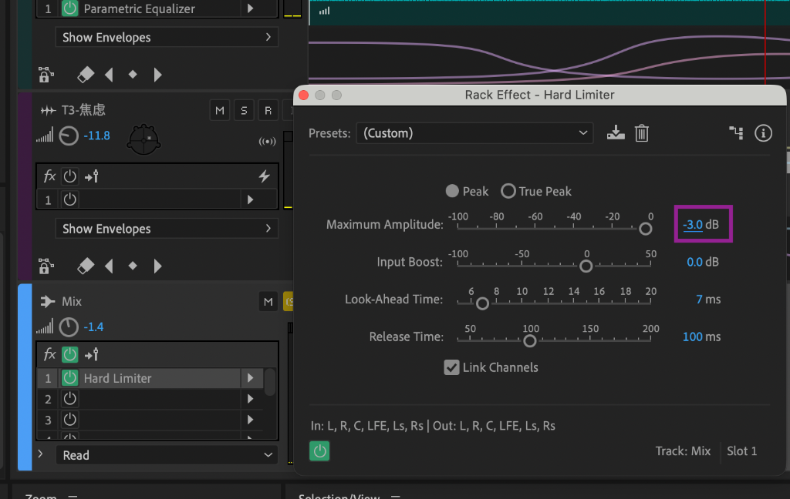
## S05_Setup_HardLimiter_Path
*   **Type**: [UI/Screenshot]
*   **Concept**: 效果架路径 (Rack Effect Path)
*   **Visual**: Dropdown menu: Amplitude and Compression > Hard Limiter on the Mix track.
*   **Ref**: 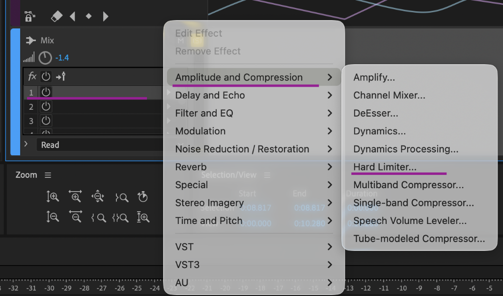

## S05_Icon_Heart
*   **Type**: [Concept Art]
*   **Concept**: 核心锚点 (The Anchor)
*   **Visual**: A 1:1 square diagram. A single solid red dot in the absolute center of a black void. Minimalist geometric style.
*   **AI_Prompt**: `minimalist abstract graphic design, a single glowing red dot in the center of a black square, bauhaus style, geometric, 8k, flat design, high contrast`
*   **Caption**: "The Heart: The Static Center."

## S05_Icon_Wall
*   **Type**: [Concept Art]
*   **Concept**: 压迫之墙 (The Wall)
*   **Visual**: A 1:1 square diagram. A massive grey block descending from the top, occupying the upper 50% of the square.
*   **AI_Prompt**: `minimalist abstract graphic design, a massive heavy grey concrete block pressing down from the top, filling half the black square, sense of weight and pressure, claustrophobic, bauhaus style, geometric, 8k`
*   **Caption**: "The Wall: The Crushing Environment."

## S05_Icon_Anxiety
*   **Type**: [Concept Art]
*   **Concept**: 焦虑螺旋 (The Needle)
*   **Visual**: A 1:1 square diagram. A chaotic, jagged white scratchy spiral line spinning frantically around the center.
*   **AI_Prompt**: `minimalist abstract graphic design, a chaotic jagged white scribble line spiraling frantically in a black square, nervous energy, messy, scratchy texture, bauhaus style, geometric, 8k`
*   **Caption**: "The Needle: The Chaotic Threat."

## S05_ILD_Diagram
*   **Type**: [Diagram]
*   **Concept**: 双耳声级差 (ILD)
*   **Visual**: A 1:1 square diagram. Top-down view of a human head (minimalist circle). Long, wavy low-frequency waves wrapping around the head (cyan). Short, straight high-frequency waves being blocked by one side of the head (white).
*   **AI_Prompt**: `minimalist scientific diagram, top-down view of a simple circle representing a head, long curved cyan waves flowing around it, short sharp white lines hitting one side and stopping, pitch black background, bauhaus geometry, 8k, ultra-clean`
*   **Caption**: "ILD: Why high frequencies define position."

## S05_Setup_Sends_Editor
*   **Type**: [UI/Screenshot]
*   **Concept**: 轨道区发送设置
*   **Visual**: Editor View showing the circular "Sends" toggle button (highlighted) and the Send 1 target set to "The Void" for Track 2 and 3.
*   **Ref**: 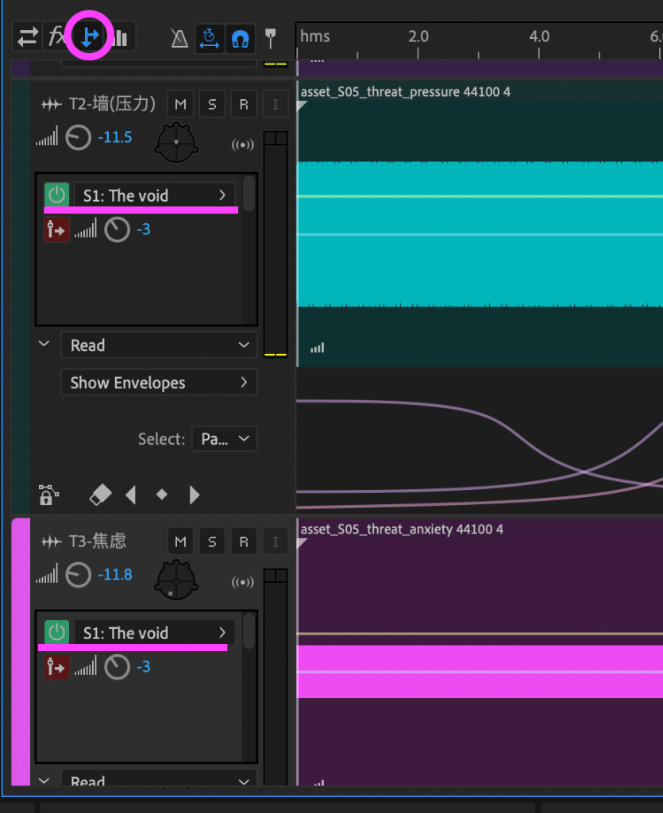
## S05_Visual_Guests
*   **Type**: [Diagram]
*   **Concept**: 客人与主人 (Spatial Logic)
*   **Visual**: A 1:1 square diagram. Central red dot (Heart/Dry) isolated from a surrounding blue hazy sphere (The Void/Wet). Inside the sphere are the Wall (grey block) and Needle (white spiral).
*   **Ref**: 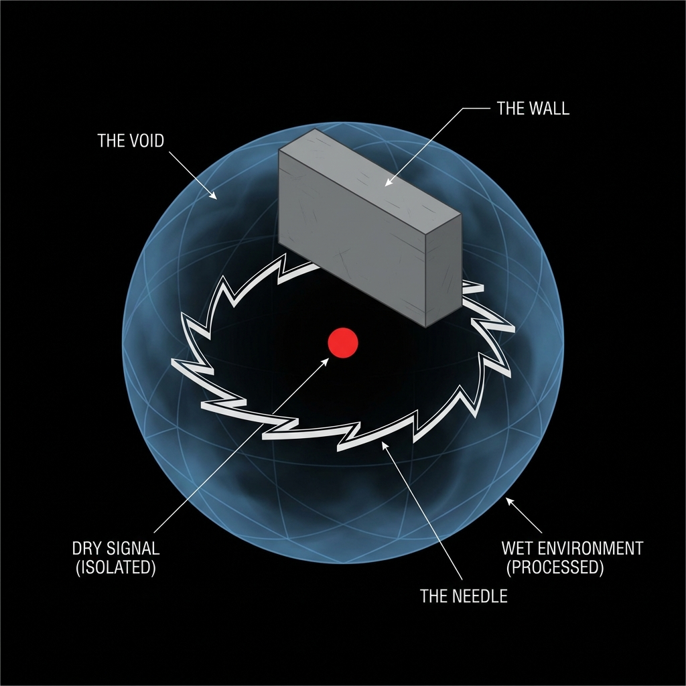
*   **Caption**: "谁是客人，谁在门外？"
